# EcoLafaek - System Architecture

**AWS AI Agent Global Hackathon - Technical Architecture Documentation**

> Complete technical architecture for the EcoLafaek environmental monitoring platform powered by Amazon Bedrock AgentCore.

---

## 🏗️ System Architecture Overview

### Core Components

---

## 🤖 AI Agent Architecture - The Heart of Innovation

### Amazon Bedrock AgentCore Implementation

**Agent Runtime ARN**: `arn:aws:bedrock-agentcore:us-east-1:account_ID:runtime/ecolafaek_waste_agent-TGrtjyF5VC`

#### Multi-Round Tool Calling Workflow

#### Available AI Agent Tools

| Tool Name                     | Purpose                   | AgentCore Component  | Example Use Case                                      |
| ----------------------------- | ------------------------- | -------------------- | ----------------------------------------------------- |
| `execute_sql_query`           | Database queries          | Direct SQL execution | "How many reports were submitted last week?"          |
| `generate_visualization`      | Create charts/graphs      | Code Interpreter     | "Show waste type distribution as a pie chart"         |
| `create_map_visualization`    | Generate interactive maps | Code Interpreter     | "Create a map of waste hotspots in Dili"              |
| `scrape_webpage_with_browser` | Web content extraction    | Browser Tools        | "What information is available on EcoLafaek website?" |
| `get_ecolafaek_info`          | Project information       | Browser Tools        | "Tell me about this platform's features"              |

---

## 📸 AI-Powered Image Analysis Pipeline

### Multi-Modal Processing with Amazon Bedrock Nova-Pro

---

## 🔍 Vector Search Implementation

### Semantic Search with Amazon Titan Embed

---

## 🚀 Deployment Architecture

### Multi-Platform Deployment Strategy

```mermaid
flowchart TB
    subgraph "Development Environment"
        Dev["💻 Developer Workstation<br/>(macOS ARM)<br/><br/>• Git repository<br/>• Local testing<br/>• Code changes"]
    end

    subgraph "Mobile Backend Deployment"
        Dev --> Script1["📜 ./deploy_lightsail.sh<br/><br/>Automated deployment:<br/>1. Create/verify AWS Lightsail instance<br/>2. Configure security groups<br/>3. Upload code bundle<br/>4. Install Python dependencies<br/>5. Setup systemd service<br/>6. Configure Nginx reverse proxy<br/>7. Setup Let's Encrypt SSL"]

        Script1 --> Instance["☁️ AWS Lightsail Instance<br/>www.ecolafaek.xyz<br/><br/>Specifications:<br/>• Bundle: micro_3_0<br/>• RAM: 1GB, CPU: 2 vCPUs<br/>• Storage: 40GB SSD<br/>• OS: Ubuntu 22.04 LTS<br/><br/>Stack:<br/>• Python 3.10 + virtual env<br/>• FastAPI + Uvicorn ASGI<br/>• Nginx (reverse proxy)<br/>• systemd (auto-restart)<br/>• Let's Encrypt SSL"]
    end

    subgraph "AgentCore Deployment"
        Dev --> CodeBuildScript["📜 agentcore launch<br/><br/>AWS CodeBuild Process:<br/>1. Upload source to S3<br/>2. Build ARM64 container<br/>3. Push to Amazon ECR<br/>4. Deploy to AgentCore<br/>5. Create runtime endpoint"]

        CodeBuildScript --> CodeBuild["🔨 AWS CodeBuild<br/><br/>Project: bedrock-agentcore-<br/>ecolafaek_waste_agent-builder<br/><br/>• Build time: ~60 seconds<br/>• Platform: linux/arm64<br/>• Runtime: Docker<br/>• Output: Container image"]

        CodeBuild --> ECRPush["📦 Amazon ECR<br/><br/>Repository:<br/>511558195893.dkr.ecr<br/>.us-east-1.amazonaws.com/<br/>bedrock-agentcore-<br/>ecolafaek_waste_agent:latest"]

        ECRPush --> AgentRuntime["🤖 Bedrock AgentCore Runtime<br/><br/>ARN: arn:aws:bedrock-agentcore:<br/>us-east-1:511558195893:runtime/<br/>ecolafaek_waste_agent-TGrtjyF5VC<br/><br/>Capabilities:<br/>• Code Interpreter (Python)<br/>• Browser Session (Playwright)<br/>• Sandboxed execution<br/>• Auto-scaling"]
    end

    subgraph "Dashboard Deployment"
        Dev --> Vercel["▲ Vercel Deployment<br/>www.ecolafaek.com<br/><br/>Features:<br/>• Next.js 14 framework<br/>• Serverless API routes<br/>• Edge functions<br/>• Global CDN<br/>• Automatic SSL<br/>• Git-based deployment"]
    end

    subgraph "Admin Panel"
        Dev --> LocalRun["💻 Local Deployment Only<br/><br/>Security Consideration:<br/>• Next.js with TypeScript<br/>• Node.js runtime (local)<br/>• Access: localhost:3001<br/>• Not exposed to internet<br/>• Direct database access<br/>• Admin authentication"]
    end

    subgraph "Monitoring & Observability"
        Instance --> Logs1["📊 System Monitoring<br/><br/>• systemd service logs<br/>• Nginx access logs<br/>• Application metrics<br/>• Health check endpoints"]
        AgentRuntime --> Logs2["📊 AWS CloudWatch<br/><br/>• AgentCore runtime logs<br/>• Tool execution metrics<br/>• Error tracking<br/>• Performance monitoring"]
        Vercel --> Logs3["📊 Vercel Analytics<br/><br/>• Page view metrics<br/>• API call statistics<br/>• Error tracking<br/>• Performance insights"]
    end

    style Dev fill:#e3f2fd
    style Instance fill:#fff3e0
    style AgentRuntime fill:#f3e5f5
    style Vercel fill:#e8f5e9
    style CodeBuild fill:#ffe0b2
    style LocalRun fill:#fce4ec
```

---

## 🔐 Security Architecture

### Multi-Layer Security Implementation

```mermaid
flowchart TD
    subgraph "Entry Points"
        A1["📱 Mobile App<br/>Flutter Client"]
        A2["🌐 Public Dashboard<br/>Web Browser"]
        A3["👨‍💼 Admin Panel<br/>Local Access Only"]
    end

    subgraph "Network Security Layer"
        B1["🔒 HTTPS Enforcement<br/><br/>• Let's Encrypt SSL/TLS 1.3<br/>• Auto-renewal certificates<br/>• HSTS headers<br/>• Secure cookie flags"]

        B2["🌐 CORS Policy<br/><br/>Allowed Origins:<br/>• www.ecolafaek.com<br/>• localhost:3000 (dev)<br/><br/>Methods: GET, POST, PUT<br/>Credentials: true"]

        B3["🛡️ Rate Limiting<br/><br/>slowapi middleware:<br/>• Chat API: 30 requests/min<br/>• Login: 10 requests/min<br/>• Registration: 5 requests/min<br/>• Reports: 60 requests/min<br/>• Global: 1000 requests/hour"]
    end

    subgraph "Authentication & Authorization"
        C1["🔑 JWT Token System<br/><br/>• Algorithm: HS256<br/>• Expiration: 24 hours<br/>• Secure secret (ENV)<br/>• Payload: user_id, exp<br/>• Automatic refresh"]

        C2["🔐 Password Security<br/><br/>• Algorithm: PBKDF2-HMAC-SHA256<br/>• Iterations: 100,000<br/>• Salt: 32 bytes (random)<br/>• Storage: Base64 encoded<br/>• No plaintext storage"]
    end

    subgraph "Bot Protection"
        D1["🛡️ reCAPTCHA v2<br/><br/>Required for:<br/>• Chat access (public)<br/>• User registration<br/>• Contact forms<br/><br/>• Token validity: 5 minutes<br/>• Single-use verification"]
    end

    subgraph "API Security"
        E1["🔒 Input Validation<br/><br/>Pydantic Models:<br/>• Type checking<br/>• Length constraints<br/>• Email validation<br/>• SQL injection prevention<br/>• XSS protection"]

        E2["🔐 Database Security<br/><br/>• Parameterized queries only<br/>• Connection pooling<br/>• Prepared statements<br/>• No dynamic SQL<br/>• Transaction isolation"]

        E3["🔑 AWS IAM Security<br/><br/>Principle of least privilege:<br/>• Bedrock: InvokeModel only<br/>• S3: PutObject, GetObject<br/>• ECR: Push, Pull images<br/>• AgentCore: Execute tools<br/>• No admin permissions"]
    end

    subgraph "Data Protection"
        F1["🗄️ Database Security<br/><br/>TiDB Cloud:<br/>• TLS 1.3 encryption<br/>• IP address whitelist<br/>• Connection pooling<br/>• Automated backups<br/>• Point-in-time recovery"]

        F2["📦 Storage Security<br/><br/>Amazon S3:<br/>• Server-side encryption<br/>• Bucket policies<br/>• Public read (reports only)<br/>• Authenticated write<br/>• Lifecycle management"]
    end

    A1 --> B1
    A2 --> B1
    A3 --> B1

    B1 --> B2
    B2 --> B3

    B3 --> C1
    B3 --> C2

    A2 --> D1

    B3 --> E1
    E1 --> E2
    E2 --> E3

    E3 --> F1
    E3 --> F2

    style B1 fill:#ffebee
    style B2 fill:#fff3e0
    style B3 fill:#e8f5e9
    style C1 fill:#e3f2fd
    style C2 fill:#f3e5f5
    style D1 fill:#fce4ec
    style E1 fill:#e0f2f1
    style E2 fill:#f1f8e9
    style E3 fill:#e8eaf6
    style F1 fill:#fff9c4
    style F2 fill:#ede7f6
```

---

## 📊 Data Architecture & Models [Click to see full Database](/database/README.md)

### Comprehensive Database Schema

---

## 🎯 Technology Stack Summary

### Comprehensive Technology Overview

---

## 📞 Additional Documentation

- **📱 Mobile App**: [../ecolafaek/README.md](../ecolafaek/README.md)
- **⚡ Backend API**: [../mobile_backend/README.md](../mobile_backend/README.md)
- **🌐 Public Dashboard**: [../ecolafaek_public_dahboard/README.md](../ecolafaek_public_dahboard/README.md)
- **👨‍💼 Admin Panel**: [../ecolafaek_admin_panel/README.md](../ecolafaek_admin_panel/README.md)
- **🗄️ Database Schema**: [../database/README.md](../database/README.md)
- **📄 Main Project**: [../README.md](../README.md)

---

  
<strong>AWS AI Agent Global Hackathon</strong>

  
Powered by Amazon Bedrock AgentCore

