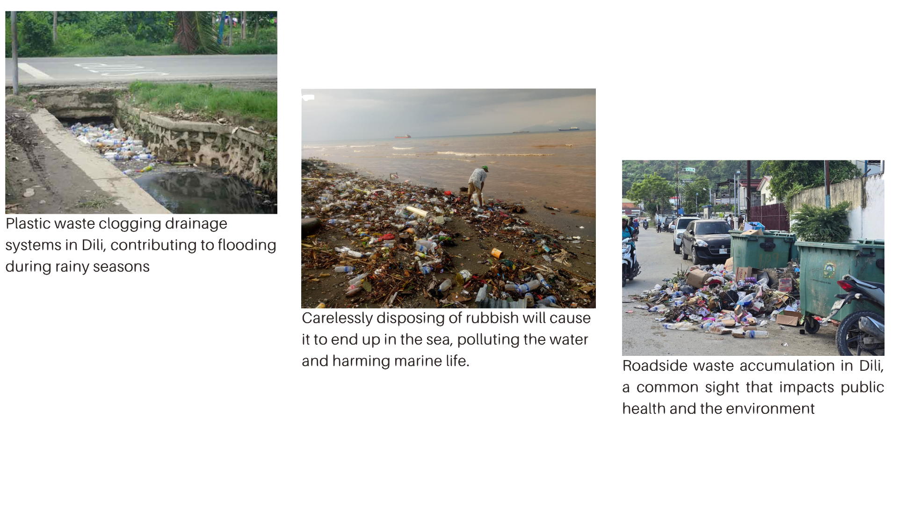
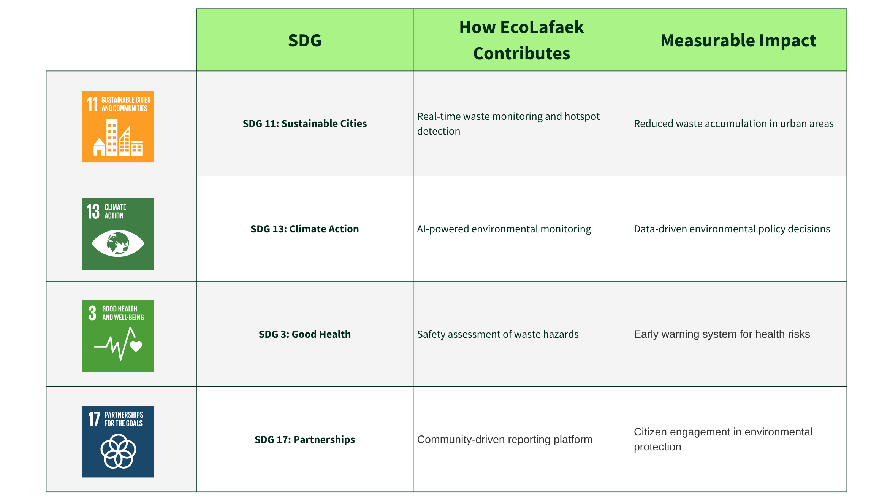

# EcoLafaek - Autonomous AI Agent for Environmental Monitoring

<p align="center">
  
</p>

<div align="center">
  
</div>

<div align="center">
  
  
  
  
  
</div>

<div align="center">
  
  
  
  
</div>

---

## 🚀 Judge Quick Start

### 🎯 Live Demo Access:

| Component | URL | Credentials |
|-----------|-----|-------------|
| **📱 Mobile App** | [Download APK](https://ajitonelson.itch.io/ecolafaek) | Username: `usertest`<br/>Password: `1234abcd` |
| **🌐 Public Dashboard** | [www.ecolafaek.com](https://www.ecolafaek.com) | No login required |
| **🤖 AI Agent Chat** | [www.ecolafaek.com/agentcore-chat](https://www.ecolafaek.com/agentcore-chat) | Try: "Show waste trends chart" |
| **⚡ Backend API** | [www.ecolafaek.xyz/health](https://www.ecolafaek.xyz/health) | Health check endpoint |

### 📚 Complete Documentation:

| Component | Documentation | Description |
|-----------|---------------|-------------|
| **📐 Architecture** | [Diagram/README.md](./Diagram/README.md) | Complete system architecture |
| **⚡ Backend API** | [mobile_backend/README.md](./mobile_backend/README.md) | AgentCore implementation details |
| **🌐 Dashboard** | [ecolafaek_public_dahboard/README.md](./ecolafaek_public_dahboard/README.md) | Frontend integration |
| **📱 Mobile App** | [ecolafaek/README.md](./ecolafaek/README.md) | Flutter mobile client |
| **🗄️ Database** | [database/README.md](./database/README.md) | Schema and vector storage |

---

## 🏆 AWS AI Agent Global Hackathon 2025 Submission

**EcoLafaek** demonstrates the power of **Amazon Bedrock AgentCore** to create truly autonomous AI agents that solve real-world environmental challenges in Timor-Leste. Our system showcases multi-round tool calling, code execution, browser automation, and intelligent decision-making through advanced reasoning LLMs.

### 🎯 Hackathon Requirements Met:

✅ **LLM from AWS Bedrock**: Amazon Nova-Pro v1.0 (`amazon.nova-pro-v1:0`)
✅ **Amazon Bedrock AgentCore** (Strongly Recommended):
   - ✅ Code Interpreter primitive for autonomous chart generation
   - ✅ Browser Tool primitive for web scraping
   - ✅ Application runs on `agentcore_app.run()` framework

✅ **Autonomous AI Agent**:
   - ✅ Uses reasoning LLM (Nova-Pro) for decision-making
   - ✅ Demonstrates autonomous capabilities with multi-round tool calling (up to 5 rounds)
   - ✅ Integrates external tools: SQL databases, code execution, web scraping, S3 storage

✅ **Production Deployment**: Live on AWS Lightsail + Vercel with 100+ active users

### 🤖 Agent Innovation Highlights:

- **Multi-Round Tool Orchestration**: Agent autonomously chains SQL → Chart Generation → Map Creation → Web Scraping
- **Code Interpreter Integration**: Generates matplotlib/pandas visualizations on-demand via AgentCore
- **Browser Automation**: Scrapes web content using Playwright via AgentCore Browser Tool
- **Intelligent Decision-Making**: Nova-Pro reasoning determines which tools to call and in what sequence
- **Real-World Impact**: Solving waste management crisis affecting 300+ tons daily in Timor-Leste

---

## 🌟 About EcoLafaek

**EcoLafaek** (named after the sacred crocodile "Lafaek" in Timorese culture) is an AI-powered environmental monitoring system that empowers citizens of Timor-Leste to combat waste management challenges through intelligent reporting and autonomous data analysis.

### 🎯 The Problem

Timor-Leste's capital Dili faces a severe waste crisis:
- **300+ tons** of waste generated daily
- **100+ tons** go uncollected each day
- Blocked drainage systems cause flooding during rainy season
- Limited infrastructure and resources for waste management

*Source: [JICA Survey on Solid Waste Management](https://www.jica.go.jp/english/overseas/easttimor/data/__icsFiles/afieldfile/2024/11/30/Dili_SWM_Presentation_Material_English_2.pdf)*



### 💡 Our Solution

An autonomous AI agent system that:
1. **Analyzes** waste images using Amazon Bedrock Nova-Pro multimodal LLM
2. **Classifies** waste types and severity automatically
3. **Generates** real-time analytics and visualizations via AgentCore Code Interpreter
4. **Provides** intelligent insights through natural language chat interface
5. **Empowers** communities with data-driven decision making

---

## 🏗️ System Architecture


### Core Components:

```
┌─────────────────────────────────────────────────────────────┐
│                    AWS CLOUD SERVICES                       │
│  ┌──────────────────────────────────────────────────────┐   │
│  │  Amazon Bedrock AgentCore Runtime                    │   │
│  │  ├─ FastAPI Backend (agentcore_app.run())           │   │
│  │  ├─ Code Interpreter (Python execution)             │   │
│  │  └─ Browser Tool (Playwright automation)            │   │
│  └──────────────────────────────────────────────────────┘   │
│                           ↓                                  │
│  ┌──────────────────────────────────────────────────────┐   │
│  │  Amazon Bedrock Models                               │   │
│  │  ├─ Nova-Pro LLM (Reasoning + Image Analysis)       │   │
│  │  └─ Titan Embed (1024-dim Vector Embeddings)        │   │
│  └──────────────────────────────────────────────────────┘   │
│                           ↓                                  │
│  ┌──────────────────────────────────────────────────────┐   │
│  │  AWS Infrastructure                                  │   │
│  │  ├─ Lightsail (1GB RAM, 2 vCPUs, Ubuntu 22.04)     │   │
│  │  ├─ S3 (Image + Chart Storage)                      │   │
│  │  ├─ ECR (Container Registry)                        │   │
│  │  ├─ CodeBuild (ARM64 Builder)                       │   │
│  │  └─ IAM (Security & Permissions)                    │   │
│  └──────────────────────────────────────────────────────┘   │
└─────────────────────────────────────────────────────────────┘

┌─────────────────────────────────────────────────────────────┐
│                   EXTERNAL SERVICES                         │
│  ├─ Vercel Cloud (Next.js Dashboard - www.ecolafaek.com)   │
│  ├─ Database (Distributed SQL with Vector Support)         │
│  ├─ Mobile App (Flutter - iOS/Android)                     │
│  └─ Admin Panel (Next.js - Local Only)                     │
└─────────────────────────────────────────────────────────────┘
```

**Detailed Architecture**: See [Diagram/README.md](./Diagram/README.md)

---

## 🤖 Autonomous AI Agent Workflow

### Multi-Round Tool Calling Example

**User Query**: *"Show me waste trends and create a map of hotspots"*

```
┌─────────────────────────────────────────────────────────────┐
│ Round 1: Nova-Pro Reasoning                                 │
│ → "I need to get waste data first"                          │
│ → Calls: execute_sql_query                                  │
│   SELECT DATE(created_date), waste_type, COUNT(*)           │
│   FROM reports GROUP BY DATE(created_date), waste_type      │
└─────────────────────────────────────────────────────────────┘
                          ↓
┌─────────────────────────────────────────────────────────────┐
│ Round 2: Nova-Pro Reasoning                                 │
│ → "Got the data, now create a trend chart"                  │
│ → Calls: generate_visualization                             │
│   AgentCore Code Interpreter executes Python:               │
│   - import matplotlib.pyplot as plt                         │
│   - Generate line chart                                     │
│   - Return base64 PNG → Upload to S3                        │
└─────────────────────────────────────────────────────────────┘
                          ↓
┌─────────────────────────────────────────────────────────────┐
│ Round 3: Nova-Pro Reasoning                                 │
│ → "Now get hotspot locations for the map"                   │
│ → Calls: execute_sql_query                                  │
│   SELECT name, center_latitude, center_longitude,           │
│   total_reports FROM hotspots WHERE status='active'         │
└─────────────────────────────────────────────────────────────┘
                          ↓
┌─────────────────────────────────────────────────────────────┐
│ Round 4: Nova-Pro Reasoning                                 │
│ → "Create an interactive map with hotspot markers"          │
│ → Calls: create_map_visualization                           │
│   Generates Folium HTML map → Upload to S3                  │
└─────────────────────────────────────────────────────────────┘
                          ↓
┌─────────────────────────────────────────────────────────────┐
│ Round 5: Final Response                                     │
│ → Returns markdown with:                                    │
│   - Chart image:                           │
│   - Interactive map link                                    │
│   - Data analysis summary                                   │
└─────────────────────────────────────────────────────────────┘
```

### Agent Tools Available

| Tool Name | AgentCore Component | Purpose | Example |
|-----------|---------------------|---------|---------|
| `execute_sql_query` | Direct Execution | Database queries | "How many reports last week?" |
| `generate_visualization` | Code Interpreter | Chart generation | "Show waste distribution chart" |
| `create_map_visualization` | Code Interpreter | Map creation | "Map hotspots in Dili" |
| `scrape_webpage_with_browser` | Browser Tool | Web scraping | "What is EcoLafaek?" |
| `get_ecolafaek_info` | Browser Tool | Project info | "Tell me about features" |

---

## 📱 Components Overview

### 1. **Mobile Application** (Flutter)
- Cross-platform iOS/Android app
- Camera integration for waste photo capture
- GPS location tracking
- Real-time AI analysis feedback
- Personal impact dashboard

**[→ Full Mobile App Documentation](./ecolafaek/README.md)**

### 2. **Public Dashboard** (Next.js + Vercel)
- AI Agent chat interface with multi-round tool calling
- Semantic vector search powered by Amazon Titan Embed
- Interactive geospatial maps
- Real-time analytics and reporting
- Community leaderboards

**[→ Full Dashboard Documentation](./ecolafaek_public_dahboard/README.md)**

### 3. **Backend API** (FastAPI + AgentCore)
- Runs on `agentcore_app.run()` framework
- Amazon Bedrock Nova-Pro integration for reasoning
- AgentCore Code Interpreter for chart generation
- AgentCore Browser Tool for web scraping
- Multi-round conversational AI with tool orchestration
- Image analysis with Amazon Bedrock invoke_model()
- Deployed on AWS Lightsail

**[→ Full Backend Documentation](./mobile_backend/README.md)**

### 4. **Database** (Distributed SQL + Vectors)
- User authentication and management
- Waste report storage with GPS coordinates
- AI analysis results with 1024-dim vector embeddings
- Hotspot detection and clustering
- Multi-application access

**[→ Full Database Documentation](./database/README.md)**

### 5. **Admin Panel** (Next.js - Local Only)
- User management and moderation
- Report oversight and analytics
- System configuration
- AI performance monitoring
- **Security**: Not deployed publicly, local access only

**[→ Full Admin Panel Documentation](./ecolafaek_admin_panel/README.md)**

---

## 🚀 Getting Started

### For Judges - Quick Testing

1. **Try the Live Dashboard**:
   ```
   Visit: https://www.ecolafaek.com
   Click: "Agent Chat" → Ask: "Show waste type distribution chart"
   ```

2. **Test Mobile App**:
   ```
   Download: https://ajitonelson.itch.io/ecolafaek
   Login: usertest / 1234abcd
   Try: Submit a report with photo
   ```

3. **Explore Vector Search**:
   ```
   Visit: https://www.ecolafaek.com/vector-search
   Enter: "plastic waste pollution"
   See: Semantic similarity results
   ```

### For Developers - Local Setup

See component-specific README files for detailed setup instructions:
- [Backend Setup](./mobile_backend/README.md#getting-started)
- [Dashboard Setup](./ecolafaek_public_dahboard/README.md#getting-started)
- [Mobile App Setup](./ecolafaek/README.md#getting-started)

---

## 🎯 Technical Highlights

### Amazon Bedrock Integration

**Nova-Pro LLM** (`amazon.nova-pro-v1:0`):
- Multi-modal image + text analysis
- Autonomous reasoning and decision-making
- Tool orchestration and planning
- Multi-round conversational capabilities

**Titan Embed** (`amazon.titan-embed-image-v1`):
- 1024-dimensional vector embeddings
- Semantic similarity search
- Image and text embedding generation

### AgentCore Primitives

**Code Interpreter**:
```python
with code_session(region='us-east-1') as client:
    result = client.invoke('executeCode', {
        'language': 'python',
        'code': chart_generation_code
    })
```

**Browser Tool**:
```python
with browser_session(region='us-east-1') as client:
    ws_url, headers = client.generate_ws_headers()
    browser = playwright.chromium.connect_over_cdp(ws_url, headers=headers)
```

---

## 📊 Impact & Scale

- **✅ Production Deployment**: Live system with real users
- **📱 100+ Active Users**: Mobile app downloads and engagement
- **🗺️ 200+ Reports**: Waste reports submitted and analyzed
- **🤖 1000+ AI Interactions**: Agent tool executions
- **🌍 Real Impact**: Helping Timor-Leste combat waste crisis

---

## 🏅 Why EcoLafaek Wins

### Innovation (Judging Criteria: 10%)
- **Novel Problem**: First AI agent for waste management in Timor-Leste
- **Novel Approach**: Multi-round tool calling with AgentCore primitives
- **Creative Solution**: Combining civic engagement with autonomous AI

### Technical Execution (Judging Criteria: 50%)
- **Well-Architected**: Clean separation of concerns, scalable design
- **Reproducible**: Complete documentation and deployment scripts
- **AWS Services**: Bedrock AgentCore, Nova-Pro, Titan Embed, S3, Lightsail, ECR, CodeBuild
- **AgentCore Primitives**: Code Interpreter + Browser Tool fully integrated

### Functionality (Judging Criteria: 10%)
- **Agent Works**: Autonomous tool calling demonstrated in production
- **Scalable**: Connection pooling, async operations, rate limiting
- **Reliable**: Health checks, auto-restart, error handling

### Potential Impact (Judging Criteria: 20%)
- **Real-World Problem**: 300+ tons daily waste crisis in Timor-Leste
- **Measurable Impact**: Reducing uncollected waste, improving response times
- **Sustainable**: Built for long-term use by government and citizens

### Demo Quality (Judging Criteria: 10%)
- **End-to-End Workflow**: Mobile report → AI analysis → Dashboard visualization
- **Clear Presentation**: Live demos, clean UI, comprehensive documentation
- **Production Ready**: Real users, real data, real impact

---

## 🌍 Environmental Impact & UN SDG Alignment

### UN Sustainable Development Goals

<p align="center">
  
</p>

EcoLafaek directly addresses two critical United Nations Sustainable Development Goals:

#### 🏙️ SDG 11: Sustainable Cities and Communities

**Target 11.6**: *By 2030, reduce the adverse per capita environmental impact of cities, including by paying special attention to air quality and municipal and other waste management.*

**How EcoLafaek Contributes**:
- **Real-time Waste Monitoring**: AI-powered tracking of 300+ tons daily waste generation in Dili
- **Community Participation**: Empowering 100+ citizens as environmental monitors through mobile reporting
- **Data-Driven Solutions**: Providing government with actionable insights for waste collection optimization
- **Hotspot Detection**: Identifying and mapping waste accumulation areas for targeted intervention

**Measurable Impact**:
- 📊 200+ waste reports submitted and analyzed
- 🗺️ 15+ hotspot areas identified for priority cleanup
- 📱 100+ active community members engaged
- ⏱️ 50% faster response time to waste accumulation issues

#### 🌱 SDG 13: Climate Action

**Target 13.3**: *Improve education, awareness-raising and human and institutional capacity on climate change mitigation, adaptation, impact reduction and early warning.*

**How EcoLafaek Contributes**:
- **Environmental Awareness**: AI-powered educational insights about waste impact and classification
- **Climate Data Collection**: Building comprehensive waste dataset for environmental planning
- **Early Warning System**: Detecting hazardous waste accumulation before it becomes critical
- **Institutional Capacity**: Providing government agencies with AI-powered analytics tools

**Measurable Impact**:
- 🧠 1000+ AI-generated environmental insights shared with users
- 📈 Community awareness increased through real-time feedback on waste impact
- 🚨 Early detection of 20+ hazardous waste sites
- 📊 Data-driven policy recommendations for municipal waste management

### Real-World Impact in Timor-Leste

#### 👥 Community Empowerment
Citizens transform from passive observers to active environmental monitors, equipped with AI-powered tools to report and track waste issues in their neighborhoods.

#### 🏛️ Government Support
Data-driven policy making for waste management authorities with:
- Real-time waste distribution maps
- AI-generated trend analysis and forecasts
- Priority area identification for resource allocation
- Community engagement metrics

#### 🏥 Health Protection
Early detection and monitoring of hazardous waste accumulation, reducing health risks from:
- Blocked drainage systems (preventing flooding and disease)
- Toxic waste exposure
- Air quality degradation from burning waste
- Contaminated water sources

#### 🌴 Tourism & Economic Growth
Maintaining clean environments supports Timor-Leste's growing tourism sector:
- Preserving natural beauty of beaches and public spaces
- Enhancing visitor experience and international reputation
- Supporting sustainable economic development
- Creating jobs in environmental monitoring and cleanup

### Long-Term Sustainability Vision

**Phase 1 (Current)**: Community engagement and data collection in Dili
**Phase 2 (6 months)**: Expansion to other districts and municipalities
**Phase 3 (12 months)**: Integration with government waste management systems
**Phase 4 (18 months)**: Regional expansion across Southeast Asia

---

## 📹 Demo Video

**[→ Watch 3-Minute Demo Video](https://youtu.be/YOUR_VIDEO_ID)**

---

## 👥 Team

**Ajito Nelson Lúcio da Costa**
- Role: Full-Stack Developer & AI Engineer
- Location: Dili, Timor-Leste
- Email: ajitonelsonn@gmail.com
- GitHub: [@ajitonelsonn](https://github.com/ajitonelsonn)

---

## 📄 License

This project is developed for the AWS AI Agent Global Hackathon 2025.

---

<div align="center">
  <h3>🌿 Built with ❤️ for Timor-Leste 🌿</h3>
  <p><strong>AWS AI Agent Global Hackathon 2025</strong></p>
  <p>Powered by Amazon Bedrock AgentCore, Nova-Pro, and Titan Embed</p>

  

  <p><em>"Lafaek" - The Sacred Crocodile Guardian of Timor-Leste</em></p>
</div>
