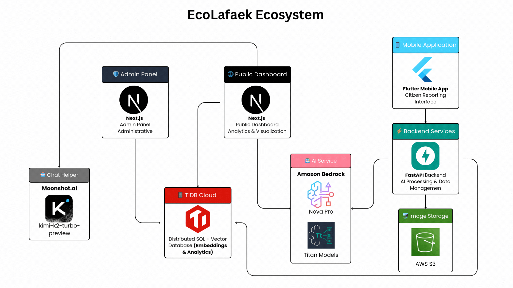

# EcoLafaek - Environmental Waste Monitoring System for Timor-Leste

  
  

  

  
  
  
  
  
  
  

---

## 🏆 For TiDB AgentX Hackathon 2025 Judges

**TiDB Cloud Account Email:** 8997ajito@gmail.com
**Cluster name:** EcoLafaek
**Database name:** db_ecolafaek

### 🚀 Judge Quick Start

**🎯 Immediate Testing:**

- **📱 [Download Mobile App](https://ecolafaek.com/download)** - Login: `usertest` / `1234abcd`
- **🌐 [Live Public Dashboard](https://ecolafaek.com)** - No login required
- **⚡ [API Health Check](https://ecolafaek.xyz/health)** - Backend status

### 📚 Complete Documentation Access

| Component               | Documentation Link                                                       |
| ----------------------- | ------------------------------------------------------------------------ |
| 📱 **Mobile App**       | [→ `./ecolafaek`](./ecolafaek/README.md)                                 |
| 🌐 **Public Dashboard** | [→ `./ecolafaek_public_dahboard`](./ecolafaek_public_dahboard/README.md) |
| ⚡ **Backend API**      | [→ `./mobile_backend`](./mobile_backend/README.md)                       |
| 🗄️ **Database Schema**  | [→ `./database`](./database/README.md)                                   |
| 🛡️ **Admin Panel**      | [→ `./ecolafaek_admin_panel`](./ecolafaek_admin_panel/README.md)         |

## 🏆 TiDB AgentX Hackathon 2025 Submission

**EcoLafaek showcases TiDB Cloud's cutting-edge vector database capabilities** to solve real-world environmental challenges in Timor-Leste. Our system leverages **1024-dimensional vector embeddings** stored directly in TiDB to power AI-driven waste similarity search, hotspot detection, and multi-application analytics.

### 🎯 TiDB Innovation Highlights:

- **Vector Database**: Storing 1024-dimensional embeddings from Amazon Titan Embed Image v1 in `VECTOR(1024)` columns
- **Similarity Search**: Real-time cosine distance calculations using `VEC_COSINE_DISTANCE()` function
- **Multi-App Architecture**: Single TiDB instance serving 3 applications simultaneously
- **Hybrid Data Types**: Vector + JSON + Spatial + Traditional SQL in unified queries
- **Production Scale**: Live system serving real users in Timor-Leste

---

## 🌟 About EcoLafaek

EcoLafaek is an innovative AI-powered waste management solution designed specifically for Timor-Leste, leveraging Amazon Bedrock's Nova Pro and Titan models to transform how communities identify, report, and address waste issues. Named after the sacred crocodile ("Lafaek") in Timorese culture, our platform serves as a guardian of the nation's natural beauty.

Timor-Leste faces significant waste management challenges, [with Dili producing over 300 tons of waste daily, and more than 100 tons going uncollected. `JICA survey page 20`.](https://www.jica.go.jp/english/overseas/easttimor/data/__icsFiles/afieldfile/2024/11/30/Dili_SWM_Presentation_Material_English_2.pdf) This waste clogs drainage systems, causes flooding during rainy seasons, and creates environmental hazards. EcoLafaek directly addresses these challenges through AI-powered analysis, community engagement, and data-driven insights.

### 🎯 Project Inspiration

Living in Timor-Leste, seeing the daily struggle with waste management inspired this solution. Every day, Dili produces over 300 tons of waste, but more than 100 tons go uncollected. During the rainy season, this waste blocks drainage systems and causes serious flooding in neighborhoods. The project combines the power of AI with community spirit to create meaningful environmental impact. Based on research from the [JICA survey](https://www.jica.go.jp/english/overseas/easttimor/data/__icsFiles/afieldfile/2024/11/30/Dili_SWM_Presentation_Material_English_2.pdf), community engagement in waste reporting can significantly improve the situation.

## 🏗️ Project Architecture

EcoLafaek consists of five integrated components:

## [ 📱 Mobile Application - Click for full Documentation](./ecolafaek/README.md)

**Location**: [`/ecolafaek`](./ecolafaek/README.md)

A Flutter-based cross-platform mobile app that empowers citizens to report waste issues with AI-powered analysis.

### Key Features:

- 📸 **Waste Reporting**: Capture photos with GPS location tracking
- 🤖 **AI Analysis**: Amazon Nova Pro automatically classifies waste types and severity
- 🗺️ **Interactive Maps**: View personal reports and community waste hotspots
- 📊 **Progress Tracking**: Monitor report status from submission to resolution
- 📈 **Personal Stats**: Track environmental impact and contribution metrics
- 🏆 **Achievement System**: Community recognition for active contributors

## [ 🌐 Public Dashboard - Click for full Documentation](./ecolafaek_public_dahboard/README.md)

**Location**: [`/ecolafaek_public_dahboard`](./ecolafaek_public_dahboard/README.md)

A Next.js web dashboard providing comprehensive analytics and visualization for government officials and the public.

### Key Features:

- 🗺️ **Geospatial Visualization**: Interactive maps with waste distribution analysis
- 📊 **Real-time Analytics**: Comprehensive statistics and trend analysis
- 🔍 **Vector Search**: AI-powered semantic search and pattern recognition
- 💬 **AI Chat Helper**: Interactive assistant powered by Moonshot AI for user guidance and FAQ support
- 🌡️ **Hotspot Analysis**: Automated identification of high-priority areas
- 🏆 **Community Leaderboard**: Recognition system for top contributors
- 📱 **Responsive Design**: Optimized for all devices and screen sizes

**Live Demo**: [ecolafaek.com](https://ecolafaek.com)

## [ 🛡️ Admin Panel - Click for full Documentation](./ecolafaek_admin_panel/README.md)

**Location**: [`/ecolafaek_admin_panel`](./ecolafaek_admin_panel/README.md)

A comprehensive Next.js administrative interface for managing the EcoLafaek system with secure role-based access control.

### Key Features:

- 🔐 **Secure Authentication**: JWT-based admin login with role management (super_admin, admin, moderator)
- 📊 **Modern Dashboard**: Real-time statistics with circular progress indicators and visual analytics
- 👥 **User Management**: Complete CRUD operations for regular users with filtering and pagination
- 🛡️ **Admin User Management**: Create and manage admin accounts with role-based permissions
- 📋 **Report Management**: Handle waste reports lifecycle and status management
- 🗺️ **Hotspot Management**: Manage environmental hotspots with interactive mapping
- 📈 **Advanced Analytics**: Detailed reporting and insights with visual charts
- 🔔 **Notification System**: Real-time notifications with read/unread status tracking
- 📤 **Data Export**: CSV export functionality for users and reports
- 🔍 **System Monitoring**: Activity logs and system health tracking
- ⚙️ **Settings Management**: Comprehensive system configuration options

**Local Development**: Currently running in development environment only

## [ ⚡ Backend Services - Click for full Documentation](./mobile_backend/README.md)

**Location**: [`/mobile_backend`](./mobile_backend/README.md)

A FastAPI-powered backend service handling AI processing, data management, and API endpoints.

### Key Features:

- 🧠 **AI Processing**: Amazon Nova Pro for waste image analysis
- 🔍 **Vector Embeddings**: Titan Embed Image v1 for similarity search
- 🌍 **Hotspot Detection**: Geographic clustering algorithms
- 🔐 **Authentication**: Secure JWT-based user management
- 📧 **Email Verification**: OTP-based account verification
- ⚡ **Async Processing**: Queue-based architecture for scalability

### AI Processing Pipeline:

1. **Phase 1**: Initial waste detection using Nova Pro
2. **Phase 2**: Detailed analysis for confirmed waste (classification, severity, volume)
3. **Phase 3**: Vector embedding generation and storage in TiDB
4. **Phase 4**: Hotspot management and pattern analysis

**Check API Health**: [ecolafaek.xyz](https://ecolafaek.xyz/health)

## [🗄️ Database Schema - Click for full Documentation](./database/README.md)

A comprehensive TiDB Cloud database design optimized for environmental monitoring with vector search capabilities.

### Key Components:

- 👥 **User Management**: Secure authentication and profile management
- 📊 **Report Processing**: Complete waste report lifecycle tracking
- 🤖 **AI Analysis Storage**: Structured results from Amazon Bedrock models
- 🎯 **Vector Storage**: 1024-dimensional embeddings for similarity search
- 🌍 **Hotspot Management**: Automated clustering and priority assessment
- 📈 **Analytics Optimization**: Pre-calculated metrics for dashboard performance

### Advanced Features:

- **Vector Columns**: `VECTOR(1024)` for image and location embeddings
- **Geospatial Queries**: Haversine formula for distance calculations
- **Auto-clustering**: Hotspot detection with 500m proximity algorithms
- **Performance Indexing**: Optimized for mobile app and dashboard queries

## 🚀 Getting Started

**For detailed setup instructions, please refer to individual component documentation above.**

Key requirements: Flutter SDK, Node.js, Python 3.8+, TiDB Cloud, Amazon Bedrock, and AWS S3.

## 🌍 Live Demo System

- **API Health Check**: [ecolafaek.xyz/health](https://ecolafaek.xyz/health)
- **Public Dashboard**: [ecolafaek.com](https://ecolafaek.com)
- **Mobile App Download**: [ecolafaek.com/download](https://ecolafaek.com/download)

## 🏆 Impact and Recognition

EcoLafaek addresses critical environmental challenges in Timor-Leste through:

1. **Community Engagement**: Empowering citizens to actively participate in environmental monitoring
2. **AI-Powered Efficiency**: Reducing false reports and improving resource allocation through intelligent analysis
3. **Data-Driven Decisions**: Providing actionable insights for government and NGO interventions
4. **Public Health Improvement**: Early identification of hazardous waste and disease vector breeding grounds
5. **Environmental Protection**: Systematic monitoring and response to waste-related environmental threats

  
<strong>Built with ❤️ for Timor-Leste</strong>

  
🐊 <em>Like the sacred crocodile, EcoLafaek guards our environment</em> 🐊

