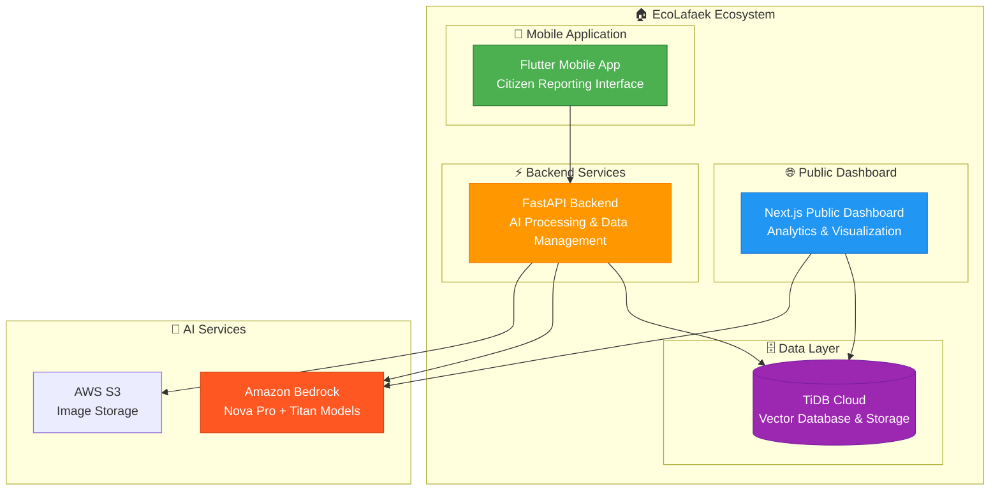

# EcoLafaek - Environmental Waste Monitoring System for Timor-Leste

<p align="center">
  
  <span style="font-size: 36px; font-weight: bold; margin: 0 20px;">
</p>

<div align="center">
  
  
  
  
  
</div>

## 🌟 About EcoLafaek

EcoLafaek is an innovative AI-powered waste management solution designed specifically for Timor-Leste, leveraging Amazon Bedrock's Nova Pro and Titan models to transform how communities identify, report, and address waste issues. Named after the sacred crocodile ("Lafaek") in Timorese culture, our platform serves as a guardian of the nation's natural beauty.

Timor-Leste faces significant waste management challenges, [with Dili producing over 300 tons of waste daily, and more than 100 tons going uncollected.](https://www.jica.go.jp/english/overseas/easttimor/data/__icsFiles/afieldfile/2024/11/30/Dili_SWM_Presentation_Material_English_2.pdf), This waste clogs drainage systems, causes flooding during rainy seasons, and creates environmental hazards. EcoLafaek directly addresses these challenges through AI-powered analysis, community engagement, and data-driven insights.

### 🎯 Project Inspiration

Living in Timor-Leste, seeing the daily struggle with waste management inspired this solution. Every day, Dili produces over 300 tons of waste, but more than 100 tons go uncollected. During the rainy season, this waste blocks drainage systems and causes serious flooding in neighborhoods. The project combines the power of AI with community spirit to create meaningful environmental impact. Based on research from the [JICA survey](https://www.jica.go.jp/english/overseas/easttimor/data/__icsFiles/afieldfile/2024/11/30/Dili_SWM_Presentation_Material_English_2.pdf), community engagement in waste reporting can significantly improve the situation.

## 🏗️ Project Architecture

EcoLafaek consists of four integrated components:



## 📱 Mobile Application

**Location**: [`/ecolafaek`](./ecolafaek/README.md)

A Flutter-based cross-platform mobile app that empowers citizens to report waste issues with AI-powered analysis.

### Key Features:

- 📸 **Waste Reporting**: Capture photos with GPS location tracking
- 🤖 **AI Analysis**: Amazon Nova Pro automatically classifies waste types and severity
- 🗺️ **Interactive Maps**: View personal reports and community waste hotspots
- 📊 **Progress Tracking**: Monitor report status from submission to resolution
- 📈 **Personal Stats**: Track environmental impact and contribution metrics
- 🏆 **Achievement System**: Community recognition for active contributors

### Technology Stack:

- **Framework**: Flutter with Provider state management
- **Maps**: OpenStreetMap integration
- **Authentication**: JWT token-based system
- **Image Processing**: Camera integration with AWS S3 upload

**Test Credentials for Judges:**

- Username: `usertest`
- Password: `1234abcd`

## 🌐 Public Dashboard

**Location**: [`/ecolafaek_public_dahboard`](./ecolafaek_public_dahboard/README.md)

A Next.js web dashboard providing comprehensive analytics and visualization for government officials and the public.

### Key Features:

- 🗺️ **Geospatial Visualization**: Interactive maps with waste distribution analysis
- 📊 **Real-time Analytics**: Comprehensive statistics and trend analysis
- 🔍 **Vector Search**: AI-powered semantic search and pattern recognition
- 🌡️ **Hotspot Analysis**: Automated identification of high-priority areas
- 🏆 **Community Leaderboard**: Recognition system for top contributors
- 📱 **Responsive Design**: Optimized for all devices and screen sizes

### Technology Stack:

- **Framework**: Next.js 15 with TypeScript and built-in API routes
- **Backend**: Next.js API routes (Node.js) - independent backend system
- **Database**: Direct TiDB Cloud connection for data and vector operations
- **AI Integration**: Direct Amazon Bedrock integration for Titan embeddings
- **Styling**: Tailwind CSS with glassmorphism design
- **Maps**: Leaflet with custom clustering algorithms
- **Charts**: Chart.js and Tremor for interactive visualizations

**Live Demo**: [ecolafaek.xyz](https://ecolafaek.xyz)

## ⚡ Backend Services

**Location**: [`/mobile_backend`](./mobile_backend/README.md)

A FastAPI-powered backend service handling AI processing, data management, and API endpoints.

### Key Features:

- 🧠 **AI Processing**: Amazon Nova Pro for waste image analysis
- 🔍 **Vector Embeddings**: Titan Embed Image v1 for similarity search
- 🌍 **Hotspot Detection**: Geographic clustering algorithms
- 🔐 **Authentication**: Secure JWT-based user management
- 📧 **Email Verification**: OTP-based account verification
- ⚡ **Async Processing**: Queue-based architecture for scalability

### Technology Stack:

- **Framework**: FastAPI with async support
- **AI Models**: Amazon Bedrock Nova Pro v1.0 + Titan Embed Image v1
- **Database**: TiDB Cloud with vector search capabilities
- **Storage**: AWS S3 for image management
- **Deployment**: AWS Lightsail with NGINX and SSL

### AI Processing Pipeline:

1. **Phase 1**: Initial waste detection using Nova Pro
2. **Phase 2**: Detailed analysis for confirmed waste (classification, severity, volume)
3. **Phase 3**: Vector embedding generation and storage in TiDB
4. **Phase 4**: Hotspot management and pattern analysis

## 🗄️ Database Schema

**Location**: [`/database`](./database/README.md)

A comprehensive TiDB Cloud database design optimized for environmental monitoring with vector search capabilities.

### Key Components:

- 👥 **User Management**: Secure authentication and profile management
- 📊 **Report Processing**: Complete waste report lifecycle tracking
- 🤖 **AI Analysis Storage**: Structured results from Amazon Bedrock models
- 🎯 **Vector Storage**: 1024-dimensional embeddings for similarity search
- 🌍 **Hotspot Management**: Automated clustering and priority assessment
- 📈 **Analytics Optimization**: Pre-calculated metrics for dashboard performance

### Advanced Features:

- **Vector Columns**: `VECTOR(1024)` for image and location embeddings
- **Geospatial Queries**: Haversine formula for distance calculations
- **Auto-clustering**: Hotspot detection with 500m proximity algorithms
- **Performance Indexing**: Optimized for mobile app and dashboard queries

## 🚀 Getting Started

### Prerequisites

- Flutter SDK (3.13.0+)
- Node.js (16+)
- Python (3.8+)
- TiDB Cloud account
- Amazon Bedrock access
- AWS S3 bucket

### Quick Setup

1. **Clone the repository:**

   ```bash
   git clone https://github.com/ajitonelsonn/EcoLafaek.git
   cd EcoLafaek
   ```

2. **Mobile App Setup:**

   ```bash
   cd ecolafaek
   flutter pub get
   flutter run
   ```

3. **Backend Setup:**

   ```bash
   cd mobile_backend
   pip install -r requirements.txt
   uvicorn main:app --reload
   ```

4. **Dashboard Setup:**

   ```bash
   cd ecolafaek_public_dahboard
   npm install
   npm run dev
   ```

5. **Configure Environment Variables:**
   - Set up TiDB Cloud connection
   - Configure Amazon Bedrock credentials
   - Set up AWS S3 bucket
   - Configure email service for OTP

## 🌍 Live Demo System

- **API Health Check**: [ecolafaek.com/health](https://ecolafaek.com/health)
- **Public Dashboard**: [ecolafaek.xyz](https://ecolafaek.xyz)
- **Mobile App Download**: [ecolafaek.com/download](https://ecolafaek.com/download)

### Test Credentials

For evaluation and testing purposes:

- **Username**: `usertest`
- **Password**: `1234abcd`

## 🏆 Impact and Recognition

EcoLafaek addresses critical environmental challenges in Timor-Leste through:

1. **Community Engagement**: Empowering citizens to actively participate in environmental monitoring
2. **AI-Powered Efficiency**: Reducing false reports and improving resource allocation through intelligent analysis
3. **Data-Driven Decisions**: Providing actionable insights for government and NGO interventions
4. **Public Health Improvement**: Early identification of hazardous waste and disease vector breeding grounds
5. **Environmental Protection**: Systematic monitoring and response to waste-related environmental threats

## 📞 Support & Contact

- **Email**: [ecolafaek@gmail.com](mailto:ecolafaek@gmail.com)
- **GitHub Issues**: [Create an Issue](https://github.com/ajitonelsonn/EcoLafaek/issues)
- **Project Documentation**: Individual component READMEs for detailed technical information

---

<div align="center">
  <p><strong>Built with ❤️ for Timor-Leste</strong></p>
  <p>🐊 <em>Like the sacred crocodile, EcoLafaek guards our environment</em> 🐊</p>
</div>
