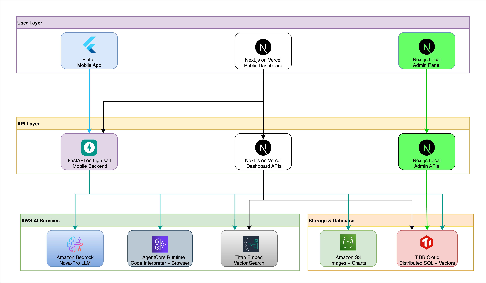
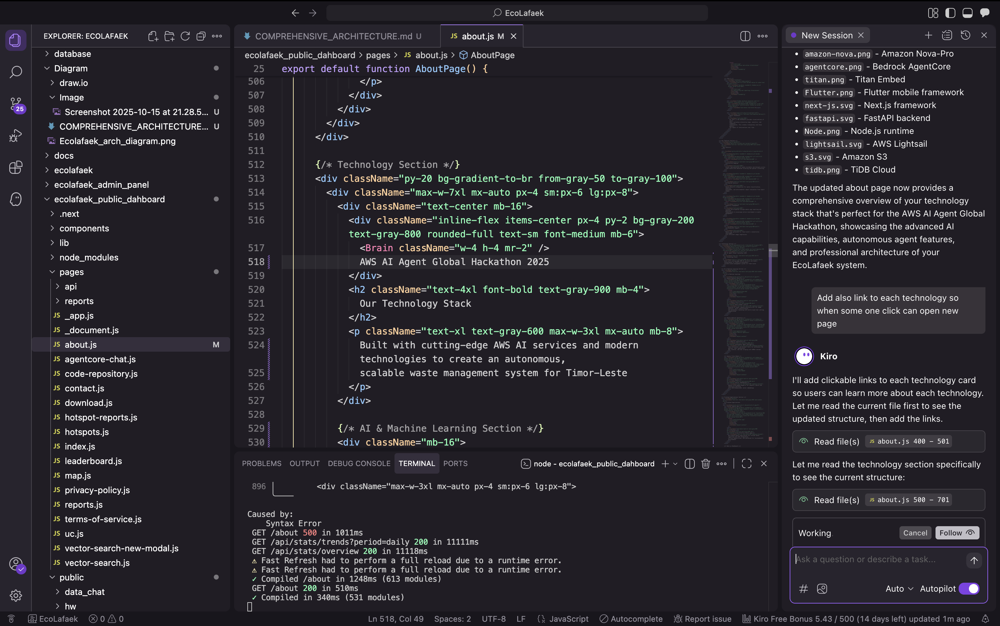

# EcoLafaek - Autonomous AI Agent for Environmental Monitoring

<p align="center">
  
</p>

<div align="center">
  
</div>

<div align="center">
  
  
  
  
  
</div>

<div align="center">
  
  
  
  
</div>

**EcoLafaek** demonstrates the power of **Amazon Bedrock AgentCore** to create truly autonomous AI agents that solve real-world environmental challenges in Timor-Leste. Our system showcases multi-round tool calling, code execution, browser automation, and intelligent decision-making through advanced reasoning LLMs.

✅ **LLM from AWS Bedrock**: Amazon Nova-Pro v1.0 (`amazon.nova-pro-v1:0`)
✅ **Amazon Bedrock AgentCore**:

- ✅ Code Interpreter primitive for autonomous chart generation
- ✅ Browser Tool primitive for web scraping
- ✅ Application runs on `agentcore_app.run()` framework

✅ **Autonomous AI Agent**:

- ✅ Uses reasoning LLM (Nova-Pro) for decision-making
- ✅ Demonstrates autonomous capabilities with multi-round tool calling (up to 5 rounds)
- ✅ Integrates external tools: SQL databases, code execution, web scraping, S3 storage

✅ **Production Deployment**: Live on AWS Lightsail + Vercel with 100+ active users

### 🤖 Agent Innovation Highlights:

- **Multi-Round Tool Orchestration**: Agent autonomously chains SQL → Chart Generation → Map Creation → Web Scraping
- **Code Interpreter Integration**: Generates matplotlib/pandas visualizations on-demand via AgentCore
- **Browser Automation**: Scrapes web content using Playwright via AgentCore Browser Tool
- **Intelligent Decision-Making**: Nova-Pro reasoning determines which tools to call and in what sequence
- **Real-World Impact**: Solving waste management crisis affecting 300+ tons daily in Timor-Leste

---

## 🚀 Judge Quick Start

### 🎯 Live Demo Access:

| Component               | URL                                                                          | Credentials                                   |
| ----------------------- | ---------------------------------------------------------------------------- | --------------------------------------------- |
| **📱 Mobile App**       | [Download APK](https://ajitonelson.itch.io/ecolafaek)                        | Username: `usertest`<br/>Password: `1234abcd` |
| **🌐 Public Dashboard** | [www.ecolafaek.com](https://www.ecolafaek.com)                               | No login required                             |
| **🤖 AI Agent Chat**    | [www.ecolafaek.com/agentcore-chat](https://www.ecolafaek.com/agentcore-chat) | Try: "Show waste trends chart"                |
| **⚡ Backend API**      | [www.ecolafaek.xyz/health](https://www.ecolafaek.xyz/health)                 | Health check endpoint                         |

### 📚 Complete Documentation:

| Component           | Documentation                                                                | Description                      |
| ------------------- | ---------------------------------------------------------------------------- | -------------------------------- |
| **📐 Architecture** | [Diagram/README.md](./Diagram/README.md)                                     | Complete system architecture     |
| **⚡ Backend API**  | [mobile_backend/README.md](./mobile_backend/README.md)                       | AgentCore implementation details |
| **🌐 Dashboard**    | [ecolafaek_public_dahboard/README.md](./ecolafaek_public_dahboard/README.md) | Frontend integration             |
| **📱 Mobile App**   | [ecolafaek/README.md](./ecolafaek/README.md)                                 | Flutter mobile client            |
| **🗄️ Database**     | [database/README.md](./database/README.md)                                   | Schema and vector storage        |

---

## 🌟 About EcoLafaek

**EcoLafaek** (named after the crocodile "Lafaek" in Timorese culture) is an AI-powered environmental monitoring system that empowers citizens of Timor-Leste to combat waste management challenges through intelligent reporting and autonomous data analysis.

### 🎯 The Problem

Timor-Leste's capital Dili faces a severe waste crisis:

- **300+ tons** of waste generated daily
- **100+ tons** go uncollected each day
- Blocked drainage systems cause flooding during rainy season
- Limited infrastructure and resources for waste management

_Source: [JICA Survey on Solid Waste Management](https://www.jica.go.jp/english/overseas/easttimor/data/__icsFiles/afieldfile/2024/11/30/Dili_SWM_Presentation_Material_English_2.pdf)_


### 💡 Our Solution

An autonomous AI agent system that:

1. **Analyzes** waste images using Amazon Bedrock Nova-Pro multimodal LLM
2. **Classifies** waste types and severity automatically
3. **Generates** real-time analytics and visualizations via AgentCore Code Interpreter
4. **Provides** intelligent insights through natural language chat interface
5. **Empowers** communities with data-driven decision making

---

## 🏗️ System Architecture


### Core Components:



**Detailed Architecture**: See [Diagram/README.md](./Diagram/README.md)

---

## 🤖 Autonomous AI Agent Workflow

### Multi-Round Tool Calling Example

**User Query**: _"Show me waste trends and create a map of hotspots"_

```
┌─────────────────────────────────────────────────────────────┐
│ Round 1: Nova-Pro Reasoning                                 │
│ → "I need to get waste data first"                          │
│ → Calls: execute_sql_query                                  │
│   SELECT DATE(created_date), waste_type, COUNT(*)           │
│   FROM reports GROUP BY DATE(created_date), waste_type      │
└─────────────────────────────────────────────────────────────┘
                          ↓
┌─────────────────────────────────────────────────────────────┐
│ Round 2: Nova-Pro Reasoning                                 │
│ → "Got the data, now create a trend chart"                  │
│ → Calls: generate_visualization                             │
│   AgentCore Code Interpreter executes Python:               │
│   - import matplotlib.pyplot as plt                         │
│   - Generate line chart                                     │
│   - Return base64 PNG → Upload to S3                        │
└─────────────────────────────────────────────────────────────┘
                          ↓
┌─────────────────────────────────────────────────────────────┐
│ Round 3: Nova-Pro Reasoning                                 │
│ → "Now get hotspot locations for the map"                   │
│ → Calls: execute_sql_query                                  │
│   SELECT name, center_latitude, center_longitude,           │
│   total_reports FROM hotspots WHERE status='active'         │
└─────────────────────────────────────────────────────────────┘
                          ↓
┌─────────────────────────────────────────────────────────────┐
│ Round 4: Nova-Pro Reasoning                                 │
│ → "Create an interactive map with hotspot markers"          │
│ → Calls: create_map_visualization                           │
│   Generates Folium HTML map → Upload to S3                  │
└─────────────────────────────────────────────────────────────┘
                          ↓
┌─────────────────────────────────────────────────────────────┐
│ Round 5: Final Response                                     │
│ → Returns markdown with:                                    │
│   - Chart image:                           │
│   - Interactive map link                                    │
│   - Data analysis summary                                   │
└─────────────────────────────────────────────────────────────┘
```

**Example Log**


### Agent Tools Available

| Tool Name                     | AgentCore Component | Purpose          | Example                         |
| ----------------------------- | ------------------- | ---------------- | ------------------------------- |
| `execute_sql_query`           | Direct Execution    | Database queries | "How many reports last week?"   |
| `generate_visualization`      | Code Interpreter    | Chart generation | "Show waste distribution chart" |
| `create_map_visualization`    | Code Interpreter    | Map creation     | "Map hotspots"                  |
| `scrape_webpage_with_browser` | Browser Tool        | Web scraping     | "What is EcoLafaek?"            |
| `get_ecolafaek_info`          | Browser Tool        | Project info     | "Tell me about features"        |

**Example Chat**


---

## 📱 Components Overview

### 1. **Mobile Application** (Flutter)

- Cross-platform iOS/Android app
- Camera integration for waste photo capture
- GPS location tracking
- Real-time AI analysis feedback
- Personal impact dashboard

**[→ Full Mobile App Documentation](./ecolafaek/README.md)**

### 2. **Public Dashboard** (Next.js + Vercel)

- AI Agent chat interface with multi-round tool calling
- Semantic vector search powered by Amazon Titan Embed
- Interactive geospatial maps
- Real-time analytics and reporting
- Community leaderboards

**[→ Full Dashboard Documentation](./ecolafaek_public_dahboard/README.md)**

### 3. **Backend API** (FastAPI + AgentCore)

- Runs on `agentcore_app.run()` framework
- Amazon Bedrock Nova-Pro integration for reasoning
- AgentCore Code Interpreter for chart generation
- AgentCore Browser Tool for web scraping
- Multi-round conversational AI with tool orchestration
- Image analysis with Amazon Bedrock invoke_model()
- Deployed on AWS Lightsail

**[→ Full Backend Documentation](./mobile_backend/README.md)**

### 4. **Database** (Distributed SQL + Vectors)

- User authentication and management
- Waste report storage with GPS coordinates
- AI analysis results with 1024-dim vector embeddings
- Hotspot detection and clustering
- Multi-application access

**[→ Full Database Documentation](./database/README.md)**

### 5. **Admin Panel** (Next.js - Local Only)

- User management and moderation
- Report oversight and analytics
- System configuration
- AI performance monitoring
- **Security**: Not deployed publicly, local access only

**[→ Full Admin Panel Documentation](./ecolafaek_admin_panel/README.md)**

---

## 🚀 Getting Started

### For Judges - Quick Testing

1. **Try the Live Dashboard**:

   ```
   Visit: https://www.ecolafaek.com
   Click: "Agent Chat" → Ask: "Show waste type distribution chart"
   ```

2. **Test Mobile App**:

   ```
   Download: https://www.ecolafaek.com/download
   Login: usertest / 1234abcd
   Try: Submit a report with photo
   ```

3. **Explore Vector Search**:
   ```
   Visit: https://www.ecolafaek.com/vector-search
   Enter: "plastic waste pollution"
   See: Semantic similarity results
   ```

### For Developers - Local Setup

See component-specific README files for detailed setup instructions:

- [Backend Setup](./mobile_backend/README.md#getting-started)
- [Dashboard Setup](./ecolafaek_public_dahboard/README.md#getting-started)
- [Mobile App Setup](./ecolafaek/README.md#getting-started)

---

## 🎯 Technical Highlights

### Amazon Bedrock Integration

**Nova-Pro LLM** (`amazon.nova-pro-v1:0`):

- Multi-modal image + text analysis
- Autonomous reasoning and decision-making
- Tool orchestration and planning
- Multi-round conversational capabilities

**Titan Embed** (`amazon.titan-embed-image-v1`):

- 1024-dimensional vector embeddings
- Semantic similarity search
- Image and text embedding generation

### AgentCore Primitives

**Code Interpreter**:

```python
with code_session(region='us-east-1') as client:
    result = client.invoke('executeCode', {
        'language': 'python',
        'code': chart_generation_code
    })
```

**Browser Tool**:

```python
with browser_session(region='us-east-1') as client:
    ws_url, headers = client.generate_ws_headers()
    browser = playwright.chromium.connect_over_cdp(ws_url, headers=headers)
```

---

## 📊 Impact & Scale

- **✅ Production Deployment**: Live system with real users
- **📱 3+ Active Users**: Mobile app downloads and engagement
- **🗺️ 50+ Reports**: Waste reports submitted and analyzed
- **🤖 25+ AI Interactions**: Agent tool executions

---

## 📹 Demo Video

**[→ Watch 3-Minute Demo Video](https://youtu.be/YOUR_VIDEO_ID)**

---

## 🛠️ Kiro - AI-powered Integrated Development Environment (IDE)

During the development of EcoLafaek, we leveraged **Kiro** - AWS's AI agent platform - to accelerate our development workflow and enhance code quality.

<p align="center">
  
</p>

### How Kiro Enhanced Our Development:

**🔍 Code Analysis & Review**

- Analyzed complex AgentCore integration code for best practices
- Identified potential bugs and security vulnerabilities
- Suggested optimizations for multi-round tool calling logic

**📊 Architecture Diagram Generation**

- Generated system architecture diagrams from codebase
- Created visual representations of agent workflow
- Helped document complex AI agent interactions

**🤖 AI Agent Code Assistance**

- Guided implementation of AgentCore Code Interpreter integration
- Provided examples for Browser Tool usage with Playwright
- Assisted with Amazon Bedrock API integration patterns

**📚 Documentation Generation**

- Helped structure comprehensive README files
- Generated API documentation from code comments
- Created deployment guides and setup instructions

**⚡ Rapid Prototyping**

- Accelerated development of visualization tools
- Streamlined database schema design
- Quick testing of different AI prompt strategies

Kiro's autonomous capabilities allowed us to focus on solving Timor-Leste's waste management challenges while maintaining high code quality and comprehensive documentation.

---

<div align="center">
  <h3>🌿 Built with ❤️ for Timor-Leste 🌿</h3>
  <p><strong>AWS AI Agent Global Hackathon</strong></p>
  <p>Powered by Amazon Bedrock AgentCore, Nova-Pro, and Titan Embed</p>


  <p><em>"Lafaek" - The Sacred Crocodile Guardian of Timor-Leste</em></p>
</div>
