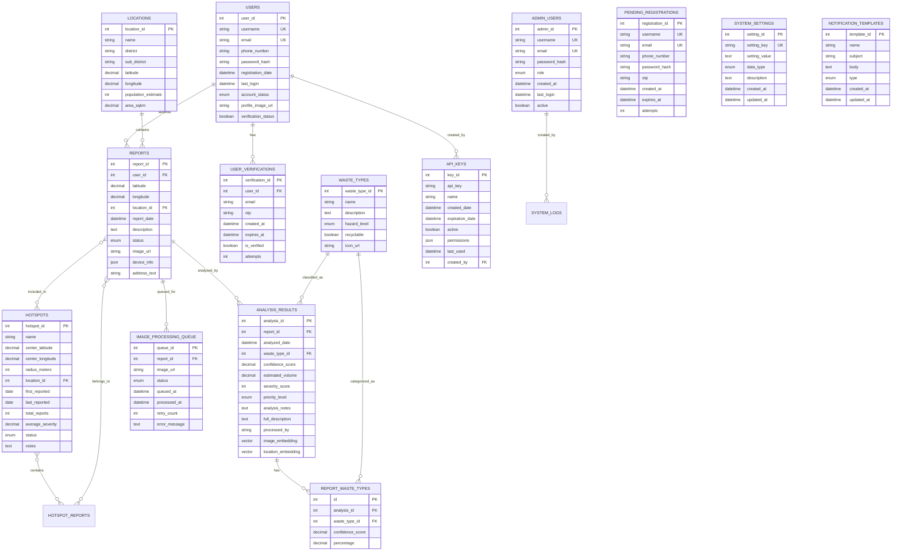

# EcoLafaek Database Schema

## Overview

This TiDB database powers the EcoLafaek environmental waste monitoring system for Timor-Leste. It manages community waste reports, AI-powered analysis with vector embeddings, user authentication, and real-time dashboard visualization.

## Entity Relationship Diagram



## Key Tables

### Core Data Tables

#### `users`

Stores registered user accounts who can submit waste reports through the mobile app.

- Authentication details secured with PBKDF2-SHA256 hashing
- Email verification system with OTP
- Status tracking for account management

#### `reports`

Citizen-submitted waste incidents with geolocation and images.

- Precise latitude/longitude for mapping
- Lifecycle tracking (submitted → analyzing → analyzed → resolved)
- S3 image URLs for waste photographs
- Device metadata for quality control

#### `analysis_results`

Amazon Bedrock Titan AI analysis of waste reports with structured insights and vector embeddings.

- Waste classification with confidence scores
- Severity assessment (1-10 scale)
- Priority categorization (low/medium/high/critical)
- Environmental impact analysis
- Volume estimation
- Detailed waste description in natural language
- **Vector Embeddings**: 1024-dimensional vectors for image and location similarity search using TiDB's vector capabilities
  - `image_embedding`: Generated from waste photos using Titan Embed Image v1 model
  - `location_embedding`: Spatial embeddings for geographic similarity analysis

#### `waste_types`

Classification taxonomy for different waste categories.

- Hazard level assessment
- Recyclability flags
- Material categories (Plastic, Metal, Organic, etc.)

#### `hotspots`

Identified areas with recurring waste problems.

- Automatically detected when 3+ reports occur within 500m
- Centroids calculated from report clusters
- Severity aggregation for prioritization
- Tracking of waste concentration over time

### Support Tables

#### `report_waste_types`

Many-to-many relationship for reports containing multiple waste types.

- Confidence scores for each waste type identified
- Percentage breakdown of mixed waste composition
- Links analysis results to multiple waste categories

#### `user_verifications` & `pending_registrations`

Two-step user registration and verification system.

- OTP-based email verification
- Temporary storage for unverified registrations
- Attempt limiting for security
- Automatic cleanup of expired verifications

#### `locations`

Predefined geographic regions and administrative divisions in Timor-Leste.

- District and sub-district hierarchies
- Population and area statistics
- Geospatial reference points for reports

#### `api_keys`

API access management for external integrations.

- Scoped permissions with JSON-based access control
- Expiration date management
- Usage tracking and analytics
- Created by user tracking for audit trails

#### `image_processing_queue`

Asynchronous queue for Amazon Bedrock Titan processing.

- Status tracking for image analysis
- Error handling with retry logic
- Performance monitoring
- Batch processing capabilities

#### `dashboard_statistics`

Pre-calculated metrics for efficient dashboard visualization.

- Aggregated metrics by location, date, and waste type
- Trend analysis indicators
- Optimized for frontend performance

#### `system_logs`

System activities audit trail for monitoring and debugging.

- API call tracking
- Error logging
- User action history

### Administrative Tables

#### `admin_users`

Administrative user accounts for the EcoLafaek admin panel with role-based access control.

- Role-based permissions (super_admin, admin, moderator)
- Secure password hashing with bcrypt
- Activity tracking with last_login timestamps
- Account status management for security
- Separate from regular citizen users for security isolation

#### `system_settings`

Configurable system parameters for application-wide settings management.

- Key-value store for application configuration
- Data type validation (string, number, boolean)
- Version control with created_at/updated_at timestamps
- Centralized configuration management
- Dynamic settings without code deployment

#### `notification_templates`

Reusable templates for system notifications across different channels.

- Multi-channel support (email, SMS, push notifications)
- Template-based messaging for consistency
- Version control and audit trail
- Customizable subject and body content
- Supports multiple notification types

## Amazon Bedrock Titan Integration

The database schema is optimized for storing structured data from Amazon Bedrock Titan models:

### Image Analysis with Titan Embed Image v1

1. **Vector Embeddings**: 1024-dimensional image embeddings stored as `VECTOR(1024)` in TiDB
2. **Similarity Search**: Cosine distance calculations using `VEC_COSINE_DISTANCE()` function
3. **Pattern Analysis**: Clustering algorithms for identifying waste patterns and hotspots

### Structured Analysis Output

1. Initial waste detection data stored in confidence_score
2. Detailed waste classification through waste_type_id
3. Comprehensive analysis via:
   - severity_score (numerical assessment)
   - priority_level (categorical assessment)
   - analysis_notes (actionable recommendations)
   - full_description (natural language summary)
   - image_embedding (for similarity search)
   - location_embedding (for geographic analysis)

## Key Database Features

1. **Spatial Indexing:** Optimized geospatial queries for proximity searching and hotspot detection

   ```sql
   CREATE INDEX idx_reports_location ON reports(latitude, longitude);
   CREATE INDEX idx_hotspots_location ON hotspots(center_latitude, center_longitude);
   ```

2. **Status Workflows:** Report lifecycle management with state tracking

   ```sql
   CREATE INDEX idx_reports_status ON reports(status);
   CREATE INDEX idx_reports_status_date ON reports(status, report_date);
   ```

3. **Async Processing:** Queue system for handling large image analysis workloads

   ```sql
   CREATE INDEX idx_queue_status ON image_processing_queue(status);
   ```

4. **Admin Panel Performance:** Optimized indexes for administrative interface

   ```sql
   CREATE INDEX idx_admin_users_username ON admin_users(username);
   CREATE INDEX idx_admin_users_email ON admin_users(email);
   CREATE INDEX idx_system_settings_key ON system_settings(setting_key);
   CREATE INDEX idx_analysis_results_date ON analysis_results(analyzed_date);
   ```

5. **Security Features:**

   - User password hashing with PBKDF2-SHA256
   - Admin password hashing with bcrypt
   - Email verification system with OTP
   - JWT authentication with secure refresh tokens
   - API key authorization with scoped permissions
   - Role-based access control for admin panel
   - Separate authentication systems for users and admins

6. **Performance Optimizations:**
   - Pre-calculated statistics for dashboards
   - Efficient spatial indexes
   - Query optimizations for mobile app performance
   - Vector index optimization for similarity search

## Security and Scaling

1. **Data Security:**

   - User passwords stored with PBKDF2-SHA256 hashing
   - Images stored in AWS S3 (only URLs in database)
   - JWT authentication with secure refresh token rotation

2. **Indexing Strategy:**

   - Spatial indexes for location-based queries
   - Performance-focused indexes on commonly filtered fields
   - Full-text search capabilities for natural language queries

3. **Scaling Considerations:**

   - Queue-based architecture for horizontal scaling
   - Read-optimized reporting tables for analytics
   - Partitioning strategy for historical data

<div align="center">
  <p>Built with ❤️ for Timor-Leste</p>
</div>
