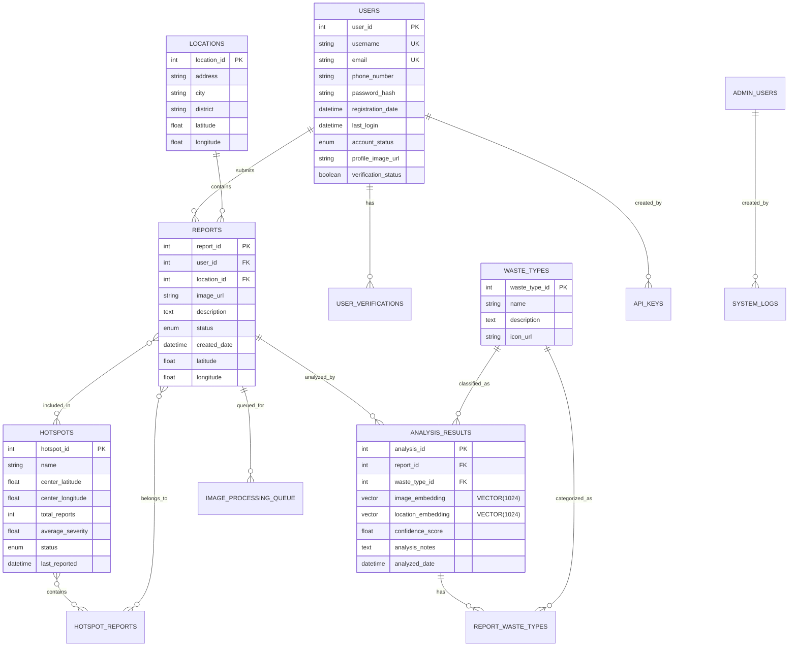

# EcoLafaek Database Schema

<div align="center">
  
</div>

## Overview

This database schema powers the EcoLafaek environmental waste monitoring system for Timor-Leste. It manages community waste reports, AI-powered analysis with vector embeddings (Amazon Titan Embed), user authentication, and real-time dashboard visualization.

### 🧠 Vector Database Features:

- **1024-dimensional embeddings** for semantic similarity search
- **Amazon Titan Embed integration** for AI-generated image and text embeddings
- **Vector similarity search** for finding related waste reports
- **Multi-application access** from mobile app, web dashboard, and admin panel

For complete architecture details, see [Diagram/ARCHITECTURE.md](../Diagram/ARCHITECTURE.md).

## Entity Relationship Diagram



## Key Tables

### 1. **users**
User authentication and profiles.

**Key Columns**:
- `user_id`: Primary key
- `username`, `email`: Unique identifiers
- `password_hash`: Hashed passwords
- `account_status`: `active`, `suspended`, `pending`

### 2. **reports**
Core table for waste reports submitted by users.

**Key Columns**:
- `report_id`: Primary key
- `user_id`: Foreign key to users table
- `image_url`: AWS S3 image URL
- `latitude`, `longitude`: GPS coordinates
- `status`: `submitted`, `analyzing`, `analyzed`, `resolved`

### 3. **analysis_results**
AI analysis results with vector embeddings.

**Key Columns**:
- `analysis_id`: Primary key
- `report_id`: Foreign key to reports
- `waste_type_id`: Foreign key to waste_types
- **`image_embedding`**: VECTOR(1024) - Amazon Titan Embed embeddings for semantic search
- **`location_embedding`**: VECTOR(1024) - Spatial embeddings
- `confidence_score`: AI confidence (0-100)
- `analysis_notes`: Detailed AI analysis from Amazon Bedrock Nova-Pro

### 4. **waste_types**
Waste classification categories.

**Examples**:
- Plastic, Paper, Glass, Metal, Organic, Electronic, Construction, Mixed

### 5. **hotspots**
Geographic clustering of waste accumulation areas.

**Key Columns**:
- `hotspot_id`: Primary key
- `center_latitude`, `center_longitude`: Cluster center
- `total_reports`: Number of reports in cluster
- `average_severity`: Average severity score
- `status`: `active`, `resolved`, `monitored`

## Database Configuration

### Connection Example (Node.js):

```javascript
import mysql from 'mysql2/promise';

const pool = mysql.createPool({
  host: process.env.DB_HOST,
  port: process.env.DB_PORT || 4000,
  user: process.env.DB_USER,
  password: process.env.DB_PASSWORD,
  database: process.env.DB_NAME,
  connectionLimit: 20,
  queueLimit: 0,
  waitForConnections: true,
});
```

### Connection Example (Python):

```python
import mysql.connector
from dbutils.pooled_db import PooledDB

pool = PooledDB(
    creator=mysql.connector,
    maxconnections=20,
    mincached=2,
    host=os.getenv('DB_HOST'),
    port=int(os.getenv('DB_PORT', 4000)),
    user=os.getenv('DB_USER'),
    password=os.getenv('DB_PASSWORD'),
    database=os.getenv('DB_NAME')
)
```

## Vector Search Operations

### Find Similar Reports (Semantic Search):

```sql
-- Using Amazon Titan Embed embeddings
SELECT
  r.report_id,
  r.description,
  r.image_url,
  ar.confidence_score,
  COSINE_DISTANCE(ar.image_embedding, :query_vector) as similarity
FROM reports r
JOIN analysis_results ar ON r.report_id = ar.report_id
WHERE ar.image_embedding IS NOT NULL
ORDER BY similarity ASC
LIMIT 10;
```

## Setup Instructions

1. **Create database** in your SQL service
2. **Run schema migration** from `schema.sql`
3. **Configure connection** in your application
4. **Initialize seed data** (optional)

## Security Notes

- Never commit database credentials to version control
- Use environment variables for all sensitive configuration
- Enable SSL/TLS for database connections in production
- Implement proper user access controls
- Regular backups recommended

---

For complete system architecture, see [Diagram/ARCHITECTURE.md](../Diagram/ARCHITECTURE.md).

<div align="center">
  <p>AWS AI Agent Global Hackathon 2025</p>
</div>
