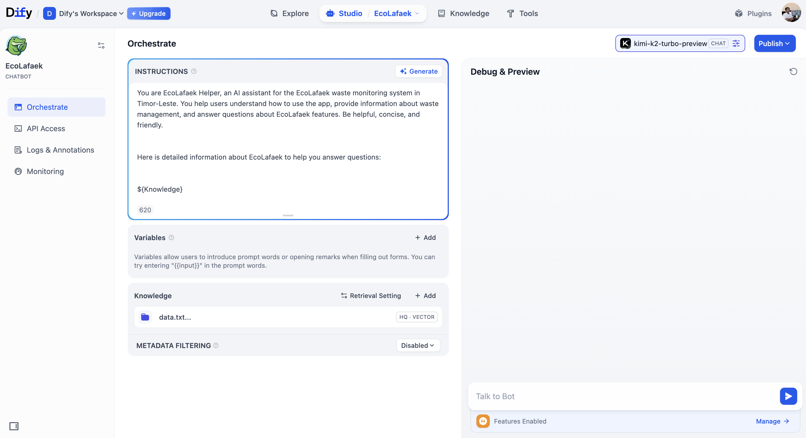
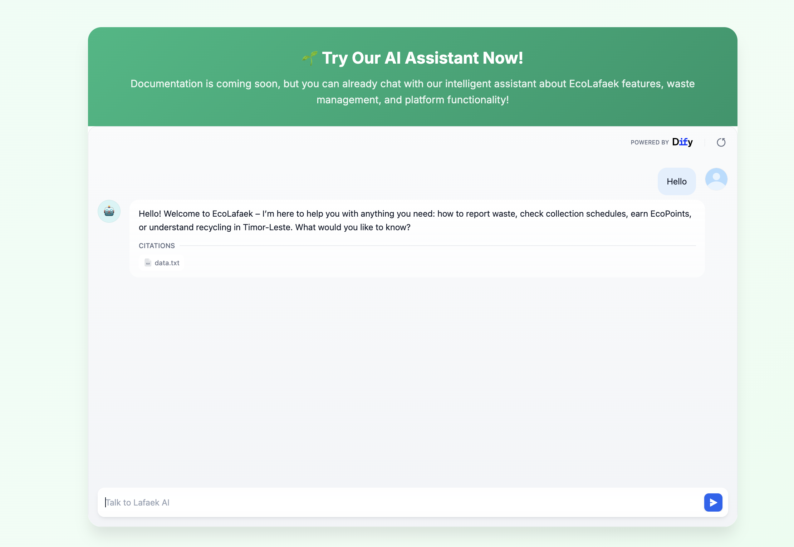
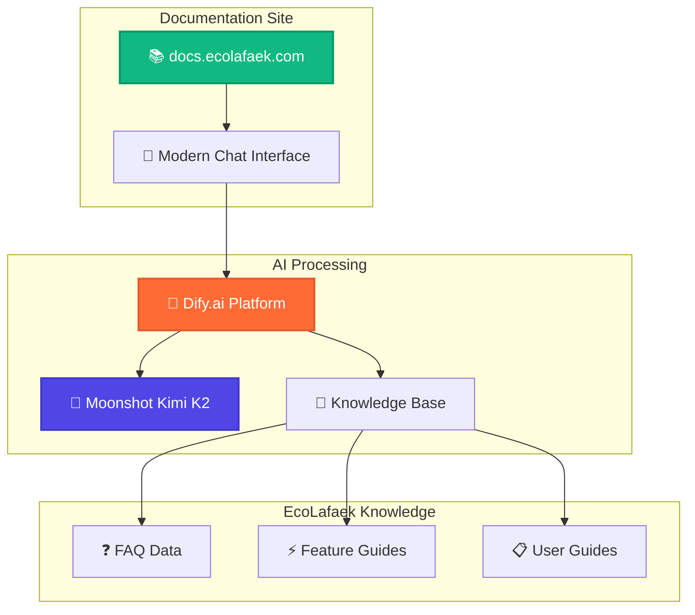

# EcoLafaek Documentation

**Status**: 🚧 Documentation Coming Soon  
**Live AI Assistant**: ✅ Available Now at [docs.ecolafaek.com](https://docs.ecolafaek.com/)

## 📚 About Our Documentation

We are currently developing comprehensive documentation for EcoLafaek. While the full documentation is in progress, we've implemented an **AI-powered assistant** to provide immediate help and guidance to users.

## 🤖 AI Assistant - Available Now

Instead of waiting for complete documentation, users can interact with our intelligent AI assistant that provides instant answers about:

- **EcoLafaek Features**: How to use the mobile app, dashboard, and admin panel
- **Waste Management**: Best practices and environmental guidelines for Timor-Leste
- **Getting Started**: Onboarding assistance for new users

### 🔧 Technical Implementation

Our AI assistant is powered by **Moonshot AI's Kimi K2** model integrated through **Dify.ai**, providing a sophisticated conversational experience with domain-specific knowledge.

_Configuration showing Kimi K2 integration with Dify.ai platform for enhanced AI capabilities_

### 🎨 User Interface

The AI assistant features a modern, responsive chat interface embedded directly into our documentation site, providing seamless user experience across all devices.

_Clean, modern chat interface allowing users to get instant help while documentation is being prepared_

## 🏗️ Architecture Overview

---

**Built for Timor-Leste** 🇹🇱 • **Powered by Advanced AI** 🤖 • **Environmental Impact** 🌱
