# EcoLafaek Mobile App

<div align="center">
    
    <span style="font-size: 36px; font-weight: bold; margin: 0 20px;">
    <h3>Guarding Timor's Beauty</h3>
    
    <p>
        <a href="https://ecolafaek.com/download" target="_blank">
            
        </a>
        <a href="https://ecolafaek.com" target="_blank">
            
        </a>
        
    </p>
</div>

## 🏆 TiDB Cloud Integration

This Flutter mobile app is part of EcoLafaek's **TiDB AgentX Hackathon 2025** submission, showcasing how mobile applications can leverage TiDB Cloud's vector database capabilities for AI-powered environmental monitoring.

### 🔗 TiDB Connection Flow:

1. **Report Submission** → FastAPI Backend → **TiDB Cloud Storage**
2. **AI Analysis** → Amazon Bedrock → **Vector Embeddings in TiDB**

## 📱 About

EcoLafaek Mobile is a citizen-focused mobile application that empowers residents of Timor-Leste to report waste issues and track their environmental impact. The app provides a streamlined experience for waste reporting with intelligent analysis and meaningful progress tracking.

### 🌱 How The App Works

#### 📸 **Waste Reporting Process**

1. **Capture**: Take a photo of the waste issue using your phone's camera
2. **Location**: GPS automatically captures the exact location of the problem
3. **Submit**: Add optional description and submit the report instantly
4. **AI Analysis**: The system automatically identifies waste types (plastic, organic, metal, etc.)
5. **Tracking**: Monitor your report status from submitted → analyzing → analyzed → resolved

#### 🗺️ **Interactive Mapping**

- **Personal Reports**: See all your submitted reports plotted on the map
- **Location Context**: Understand waste patterns by geographic distribution

## 🔍 App Screens

### 🔐 Login / Registration

User authentication and account creation.

<p align="center">
  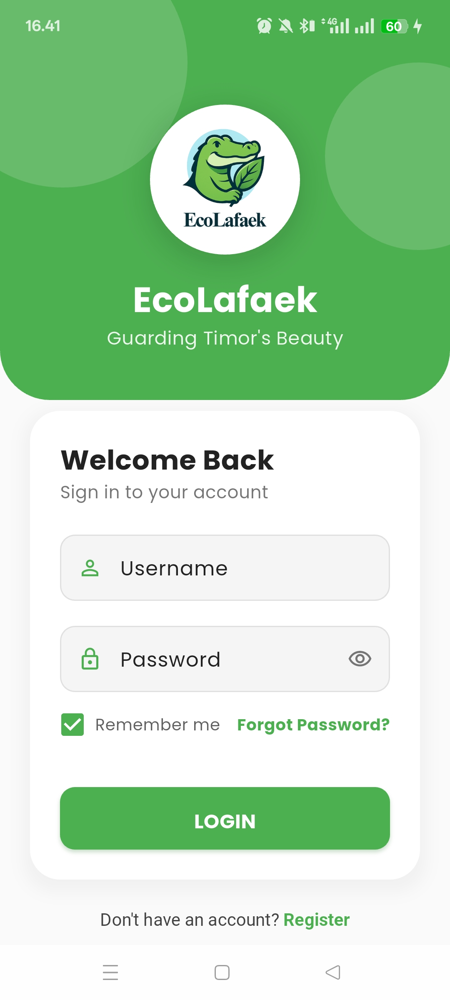
  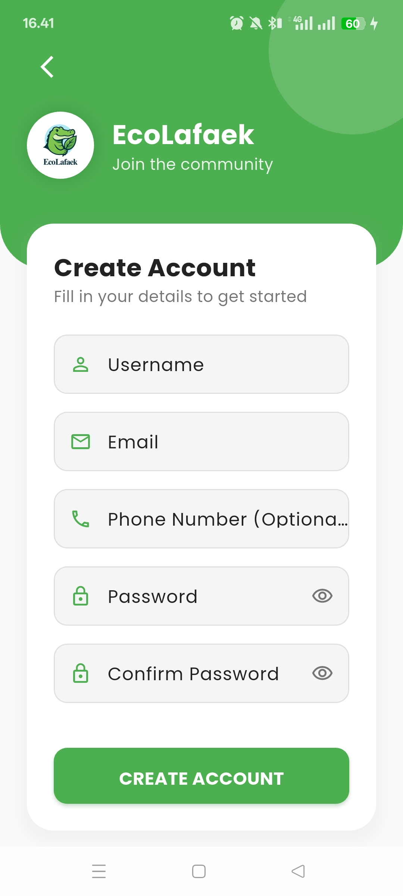
</p>

---

### 🏠 Home Dashboard

Overview of user's reports and statistics.

<p align="center">
  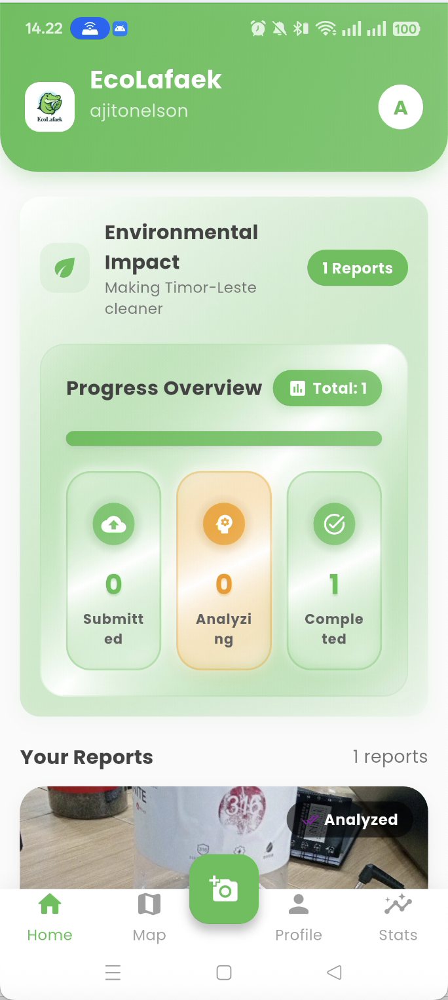
</p>

---

### 📝 Report Creation

Form for submitting waste reports with photos and location.

<p align="center">
  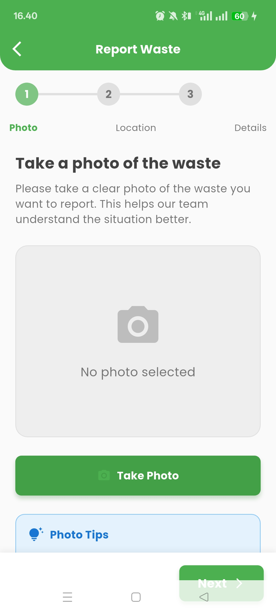
  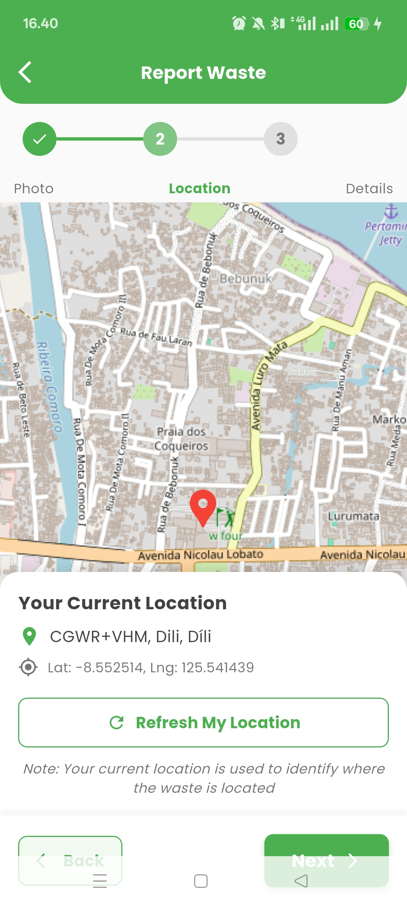
  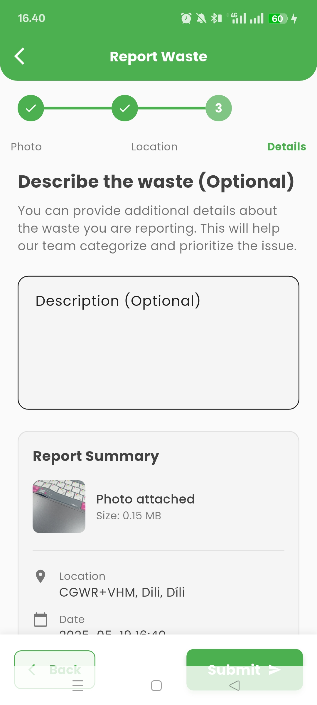
</p>

---

### 🗺️ Map View

Geographic display of submitted reports.

<p align="center">
  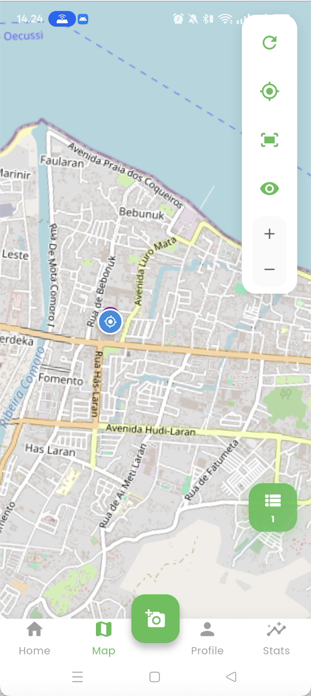
</p>

---

### 📄 Report Details

Detailed view of submitted reports with status updates.

<p align="center">
  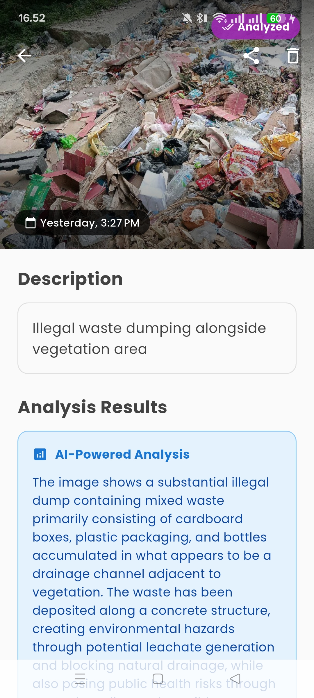
</p>

---

### 👤 Profile

User account management and settings.

<p align="center">
  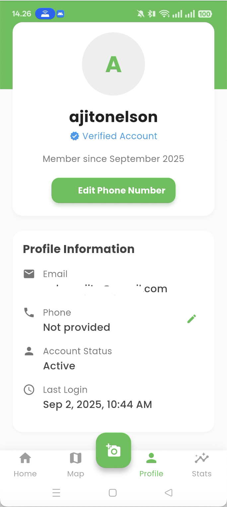
</p>

---

### 📈 Stats

Detailed view of user and general reporting stats.

<p align="center">
  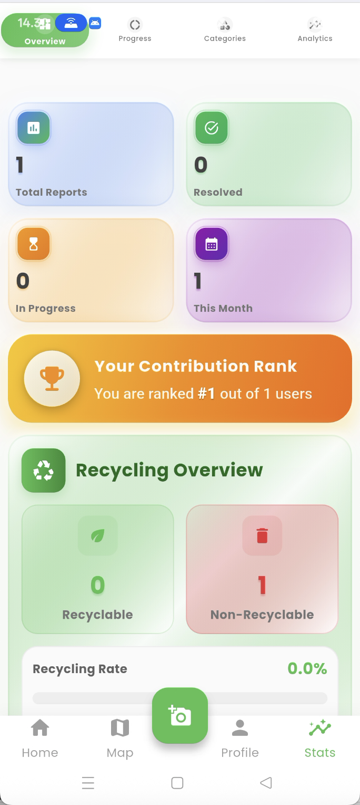
  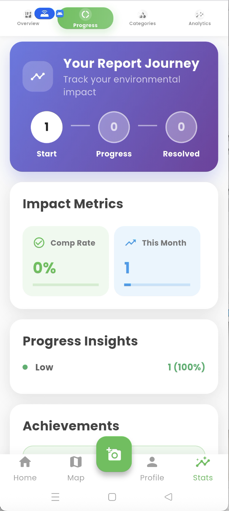
  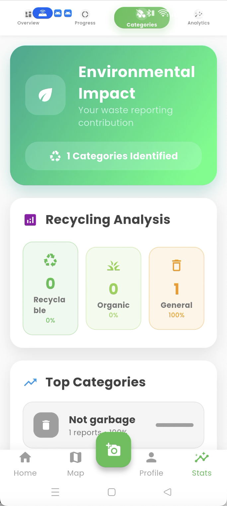
  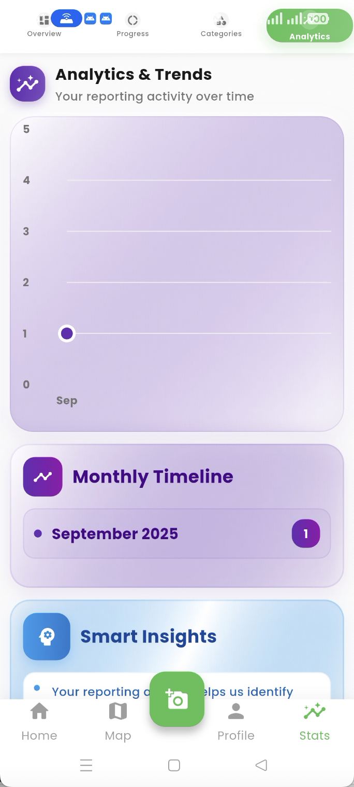
</p>

## 🖥️ Technical Overview

### System Architecture

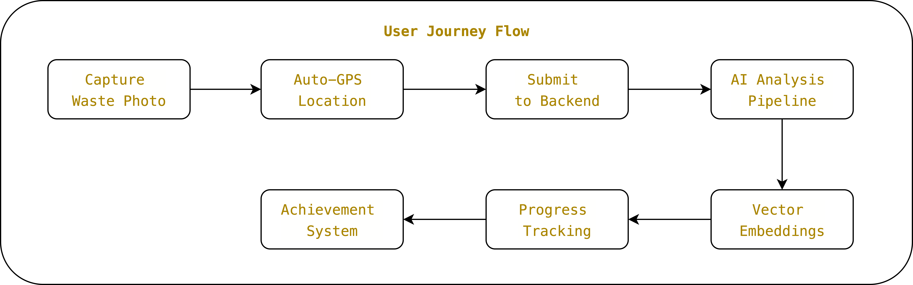

**Advanced AI-Powered Architecture**: The EcoLafaek mobile app leverages cutting-edge AI and vector database technology to deliver intelligent waste monitoring. Images are stored in AWS S3 and analyzed using Amazon Nova Pro v1, while Amazon Titan Embed Image v1 generates 1024-dimensional vector embeddings stored in TiDB. This enables semantic similarity search, hotspot detection, and advanced analytics for environmental insights.

### Technology Stack

#### **Mobile App (Flutter)**

EcoLafaek is built with Flutter, providing a cross-platform solution for both Android and iOS users. The app follows a provider-based state management pattern with a clean, modular architecture.

- **Frontend**: Flutter/Dart
- **State Management**: Provider
- **Backend Integration**: HTTP/REST API
- **Maps**: Flutter Map (OpenStreetMap)
- **Authentication**: JWT Token-based auth

#### **Backend & AI Infrastructure**

The backend leverages modern cloud services and AI technology for intelligent waste analysis:

- **API Server**: FastAPI (Python) with async support
- **Database**: TiDB Cloud with VECTOR(1024) columns for embeddings
- **AI Analysis**: Amazon Nova Pro v1 for waste classification
- **Vector Embeddings**: Amazon Titan Embed Image v1 (1024-dimensional)
- **Image Storage**: AWS S3 with organized folder structure
- **Geographic Analytics**: Hotspot detection using spatial clustering

### Dependencies

- `provider`: ^6.0.5
- `http`: ^1.1.0
- `flutter_map`: ^5.0.0
- `latlong2`: ^0.9.0
- `geolocator`: ^10.0.0
- `image_picker`: ^1.0.4
- `cached_network_image`: ^3.3.0
- `flutter_secure_storage`: ^9.0.0
- `shared_preferences`: ^2.2.1
- `intl`: ^0.18.1
- `animate_do`: ^3.1.2

_Full dependencies in pubspec.yaml_

## 🚀 Getting Started

### Prerequisites

- Flutter SDK (3.13.0 or later)
- Dart SDK (3.1.0 or later)
- Android Studio / XCode
- Git

### Installation

1. Clone the repository:

```bash
git clone https://github.com/ajitonelsonn/EcoLafaek.git
cd EcoLafaek/ecolafaek
```

2. Install dependencies:

```bash
flutter pub get
```

3. Create `.env.development` file with required environment variables:

```
API_BASE_URL=http://your-api-url
```

4. Run the app:

```bash
flutter run
```

## 📊 Project Structure

```
lib/
├── main.dart                              # App entry point with provider setup
├── config/
│   └── theme.dart                         # App-wide theme configuration
├── models/                                # Data models
│   ├── report.dart                        # Waste report data structure
│   ├── user.dart                          # User profile model
│   └── waste_type.dart                    # Waste classification types
├── providers/                             # State management (Provider pattern)
│   ├── auth_provider.dart                 # User authentication & session
│   ├── location_provider.dart             # GPS location services
│   ├── report_provider.dart               # Report CRUD operations
│   └── stats_provider.dart                # Analytics & impact metrics
├── screens/                               # Main app screens
│   ├── home_screen.dart                   # Dashboard with report tracking
│   ├── login_screen.dart                  # User authentication
│   ├── register_screen.dart               # User registration
│   ├── report_screen.dart                 # Waste report submission
│   ├── map_screen.dart                    # Interactive map with reports
│   ├── stats_screen.dart                  # Personal impact analytics
│   ├── profile_screen.dart                # User account management
│   ├── report_detail_screen.dart          # Individual report details
│   └── otp_verification_screen.dart       # Email verification
├── services/                              # External service integrations
│   ├── api_service.dart                   # Backend API communication
│   ├── auth_service.dart                  # JWT token management
│   └── storage_service.dart               # Local data persistence
├── widgets/                               # Reusable UI components
│   ├── loading_widget.dart                # EcoLafaek crocodile loader
│   ├── loading_indicator.dart             # Compact loading states
│   ├── report_card.dart                   # Report display cards
│   ├── report_tracking_widget.dart        # Modern progress dashboard
│   └── custom_button.dart                 # Themed buttons
└── utils/                                 # Helper functions
    ├── navigation_utils.dart              # Route management
    └── date_utils.dart                    # Date formatting
```

---

## For Judges

To review and test the app, judges can easily [download the mobile app](https://ecolafaek.com/download) and login using the following credentials:

### Login Credentials

| Username | Password |
| -------- | -------- |
| usertest | 1234abcd |

---

<div align="center">
  <p>Built with ❤️ in Timor-Leste</p>
</div>
