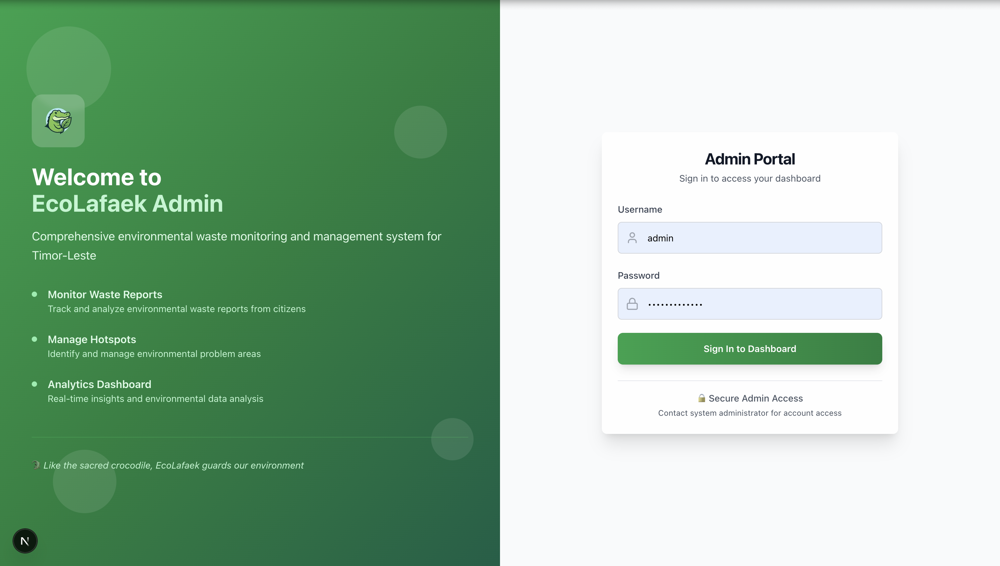
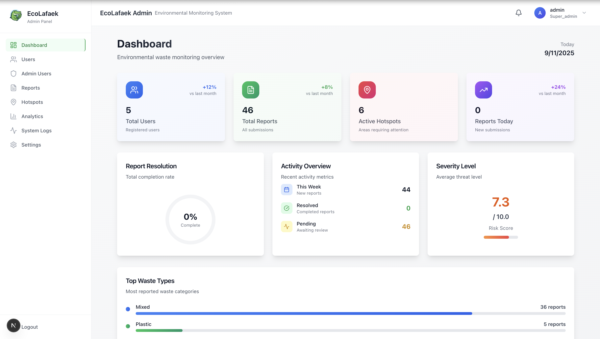
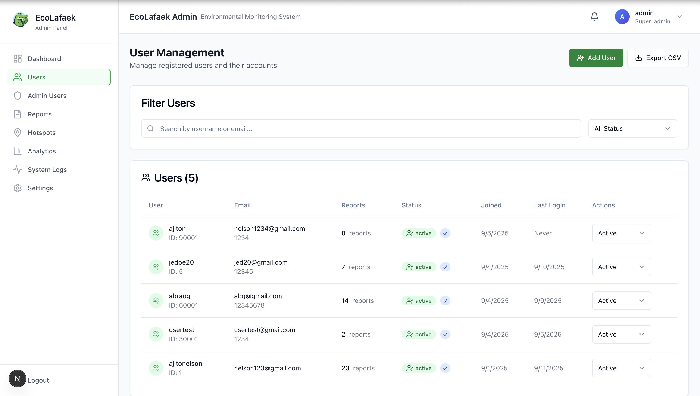
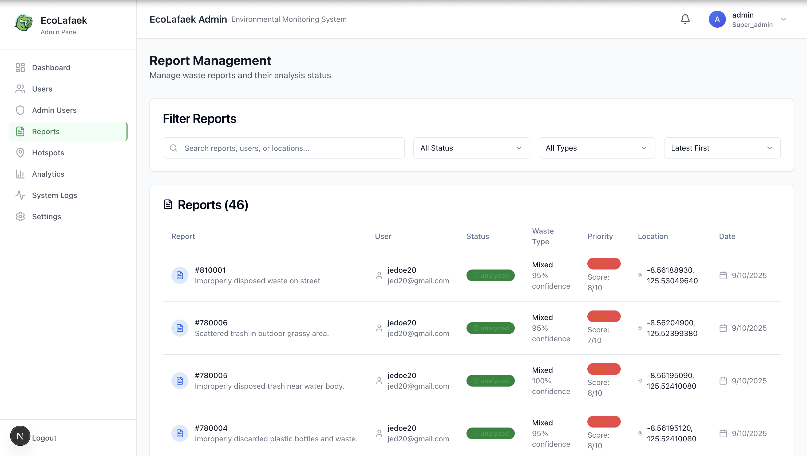
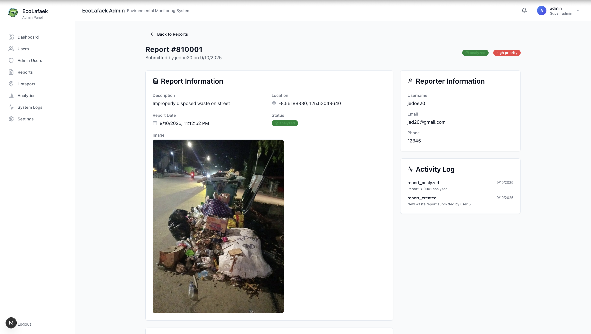
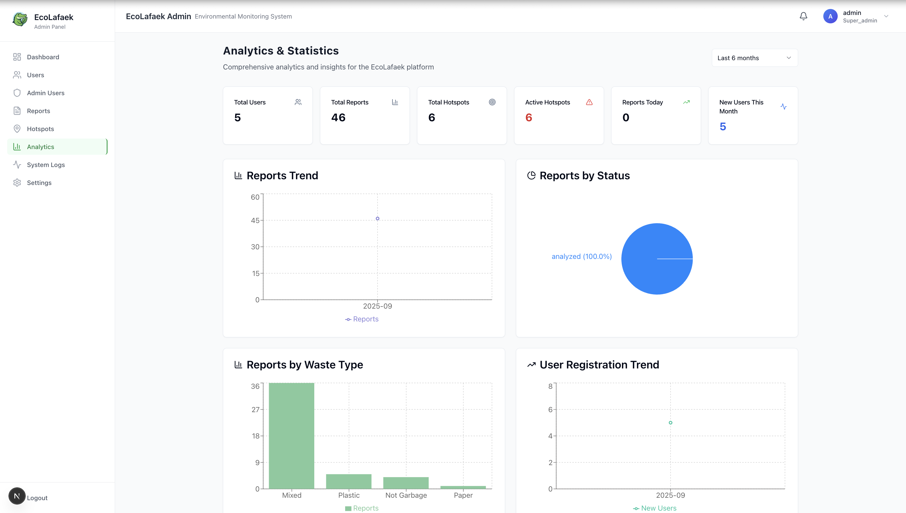
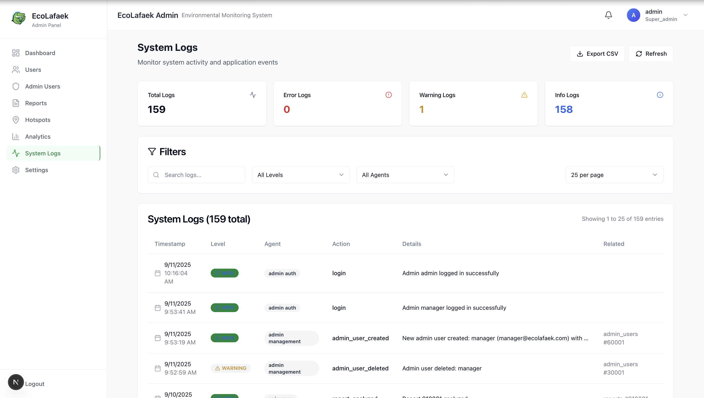

<div align="center">
  <h1>🌿 EcoLafaek Admin Panel</h1>
  
  <p><strong>A comprehensive administrative interface for the EcoLafaek environmental waste monitoring system</strong></p>
  
  
  
  <p><strong>Powered by TiDB Cloud Vector Database</strong></p>
  
  <p>📍 <em>Currently running in local development environment only</em></p>
  
  <br/>
</div>

## 🏆 TiDB Cloud Administration Features

This admin panel showcases **TiDB Cloud's enterprise-grade capabilities** for the TiDB AgentX Hackathon 2025:

### 🗃️ Advanced TiDB Operations:

- **Vector Data Management**: Administer 1024-dimensional embeddings and similarity searches
- **Multi-Table Joins**: Complex queries spanning users, reports, analysis_results, and admin_users tables
- **Real-time Analytics**: Live statistics powered by TiDB's high-performance queries
- **Role-Based Access**: Secure admin authentication with JWT stored in TiDB admin_users table
- **System Monitoring**: Track database performance and vector search efficiency

### 🧠 TiDB Vector Integration:

```sql
-- Real vector analytics with month-over-month growth
SELECT
  COUNT(CASE WHEN image_embedding IS NOT NULL THEN 1 END) as with_embeddings,
  COUNT(CASE WHEN location_embedding IS NOT NULL THEN 1 END) as with_location_embeddings,
  AVG(confidence_score) as avg_confidence,
  COUNT(CASE WHEN confidence_score >= 90 THEN 1 END) as high_confidence_analyses
FROM analysis_results;

-- Growth comparison queries (current vs last month)
SELECT
  COUNT(CASE WHEN MONTH(analyzed_date) = ? AND YEAR(analyzed_date) = ? THEN 1 END) as current_month,
  COUNT(CASE WHEN MONTH(analyzed_date) = ? AND YEAR(analyzed_date) = ? THEN 1 END) as last_month
FROM analysis_results WHERE image_embedding IS NOT NULL;
```

### 📊 Database Administration:

- **User Management**: CRUD operations on TiDB users table
- **Report Oversight**: Monitor waste reports lifecycle in TiDB
- **Vector Analytics**: Analyze AI embedding performance and accuracy
- **System Settings**: Configure TiDB-stored application parameters

## 🚀 Features

- **🔐 Secure Authentication** - JWT-based admin login system with role management
- **📊 Modern Dashboard** - Real-time statistics with circular progress indicators and TiDB vector analytics
- **🧠 Vector Analytics Dashboard** - Live TiDB vector embeddings monitoring with 1024-dimensional insights
- **📈 Month-over-Month Growth Tracking** - Real comparison analytics (vs last month/yesterday)
- **👥 User Management** - Complete CRUD operations for regular users
- **🛡️ Admin User Management** - Create and manage admin accounts with role-based permissions
- **📋 Report Management** - Handle waste reports and their statuses
- **🗺️ Hotspot Management** - Manage environmental hotspots with interactive maps
- **📈 Advanced Analytics** - Detailed reporting and insights with visual charts
- **🤖 AI Confidence Monitoring** - Track Amazon Bedrock AI analysis performance
- **👤 Profile Management** - Change passwords and update profile information
- **🔍 System Monitoring** - Activity logs and system health tracking
- **📤 Data Export** - CSV export functionality for users and reports
- **⚙️ Settings Management** - Comprehensive system configuration

## 🛠️ Tech Stack

- **Framework**: Next.js 15 with TypeScript
- **Styling**: Tailwind CSS + shadcn/ui components
- **Database**: TiDB Cloud with SSL connection
- **Authentication**: JWT with HTTP-only cookies

## 📋 Prerequisites

- Node.js 16+ and npm
- TiDB Cloud database access
- Git for version control

## ⚡ Quick Start

### 📥 Installation

```bash
# 1. Clone the repository
git clone https://github.com/ajitonelsonn/EcoLafaek.git
cd EcoLafaek/ecolafaek_admin_panel

# 2. Install dependencies
npm install
```

### 🔧 Configuration

```bash
# 3. Setup environment variables
cp example.env.example .env.local
```

**Update `.env.local` with your credentials:**

```env
# Database Configuration (TiDB Cloud)
DB_HOST=gateway01.ap-northeast-1.prod.aws.tidbcloud.com
DB_NAME=db_ecolafaek
DB_USER=your_tidb_user
DB_PASSWORD=your_tidb_password
DB_PORT=4000

# JWT Secret for admin authentication
JWT_SECRET=your-secure-jwt-secret-key

# Application Settings
NEXTAUTH_URL=http://localhost:3000
NEXTAUTH_SECRET=your-nextauth-secret
NODE_ENV=development
```

### 🗄️ Database Setup

```bash
# 4. Execute the setup.sql file in your TiDB database
```

### 🚀 Launch

```bash
# 5. Start development server
npm run dev

# 6. Open in browser
# Navigate to http://localhost:3000
```

## 🗄️ Database Setup

### Required Tables

The admin panel requires these database tables:

- `admin_users` - Admin authentication and roles
- `users` - Application users (from main EcoLafaek system)
- `reports` - Waste reports
- `analysis_results` - AI analysis data
- `hotspots` - Environmental hotspots
- `waste_types` - Waste classification types
- `system_logs` - Activity logging

---

### 👤 Default Admin Accounts

The setup script creates default admin accounts:

<table>
<tr>
<th>Account Type</th>
<th>Username</th>
<th>Password</th>
<th>Role</th>
<th>Email</th>
</tr>
<tr>
<td>🔑 Super Admin</td>
<td><code>admin</code></td>
<td><code>admin123</code></td>
<td><code>super_admin</code></td>
<td><code>admin@ecolafaek.com</code></td>
</tr>
</table>

## 🔑 Authentication

### Admin Roles

- **super_admin** - Full system access
- **admin** - Standard administrative privileges
- **moderator** - Limited management access

## 📁 Project Structure

```
ecolafaek_admin_panel/
├── src/
│   ├── app/
│   │   ├── api/                 # API routes
│   │   │   ├── auth/           # Authentication endpoints
│   │   │   ├── dashboard/      # Dashboard data
│   │   │   ├── users/          # User management API
│   │   │   ├── admin-users/    # Admin user management API
│   │   │   ├── notifications/  # Notification system API
│   │   │   └── settings/       # System settings API
│   │   ├── login/              # Login page
│   │   ├── users/              # User management page
│   │   ├── admin-users/        # Admin user management page
│   │   ├── reports/            # Report management page
│   │   ├── hotspots/           # Hotspot management page
│   │   ├── analytics/          # Analytics dashboard
│   │   ├── logs/               # System logs page
│   │   ├── settings/           # Settings configuration
│   │   └── page.tsx            # Modern dashboard homepage
│   ├── components/
│   │   ├── ui/                 # Reusable UI components
│   │   ├── layout/             # Layout components
│   │   └── dashboard/          # Dashboard-specific components
│   ├── lib/
│   │   ├── auth.ts             # Authentication utilities
│   │   ├── db.ts               # Database connection
│   │   └── utils.ts            # General utilities
│   ├── types/
│   │   └── index.ts            # TypeScript definitions
│   └── middleware.ts           # Route protection
├── public/                     # Static assets
├── setup.sql                   # Database initialization
└── README.md                   # Documentation
```

## 🔧 Development

### Available Scripts

```bash
npm run dev      # Start development server
npm run build    # Build for production
npm run start    # Start production server
```

### 🔗 API Endpoints

<details>
<summary><strong>🔐 Authentication</strong></summary>

| Method | Endpoint                    | Description            |
| ------ | --------------------------- | ---------------------- |
| `POST` | `/api/auth/login`           | Admin login            |
| `POST` | `/api/auth/logout`          | Admin logout           |
| `GET`  | `/api/auth/me`              | Get current admin user |
| `PUT`  | `/api/auth/profile`         | Update admin profile   |
| `PUT`  | `/api/auth/change-password` | Change admin password  |

</details>

<details>
<summary><strong>📊 Dashboard & Analytics</strong></summary>

| Method | Endpoint                | Description                                                        |
| ------ | ----------------------- | ------------------------------------------------------------------ |
| `GET`  | `/api/dashboard/stats`  | Get dashboard statistics with real growth metrics                  |
| `GET`  | `/api/analytics`        | Get comprehensive analytics with date filtering                    |
| `GET`  | `/api/vector-analytics` | 🏆 **TiDB Vector Analytics** - Advanced vector embeddings insights |

#### 🧠 Vector Analytics Features:

- **1024-dimensional embeddings analysis** - Track AI-generated vector storage
- **Month-over-month comparisons** - Real growth calculations vs previous periods
- **Confidence distribution tracking** - Monitor AI analysis accuracy trends
- **Waste type embedding patterns** - Vector clustering by waste categories
- **Processing efficiency metrics** - TiDB vector operation performance

</details>

<details>
<summary><strong>👥 User Management</strong></summary>

| Method  | Endpoint     | Description                          |
| ------- | ------------ | ------------------------------------ |
| `GET`   | `/api/users` | List users with pagination/filtering |
| `POST`  | `/api/users` | Create new user account              |
| `PATCH` | `/api/users` | Update user status                   |

</details>

<details>
<summary><strong>🛡️ Admin User Management</strong></summary>

| Method   | Endpoint                | Description           | Access           |
| -------- | ----------------------- | --------------------- | ---------------- |
| `GET`    | `/api/admin-users`      | List admin users      | super_admin only |
| `POST`   | `/api/admin-users`      | Create new admin user | super_admin only |
| `PUT`    | `/api/admin-users/[id]` | Update admin user     | super_admin only |
| `DELETE` | `/api/admin-users/[id]` | Delete admin user     | super_admin only |

</details>

---

## 🖼️ Interface Screenshots

<div align="center">

### 🔐 Login Page



### 📊 Dashboard



### 👥 User Management



### 📋 Reports Management



### 📄 Report Details



### 🗺️ Hotspots Management



### 📈 Analytics Dashboard



</div>

---

<div align="center">
  <p><strong>Built with ❤️ for Timor-Leste</strong></p>
  <p>🐊 <em>Like the sacred crocodile, EcoLafaek guards our environment</em> 🐊</p>
</div>
