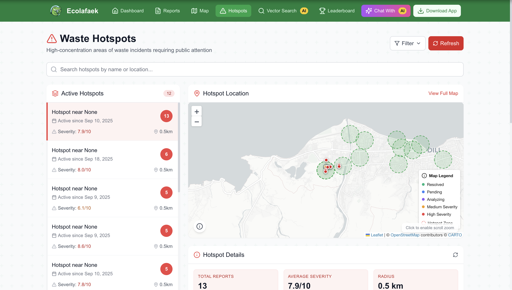

# EcoLafaek Public Dashboard

<p align="center">
  
  <span style="font-size: 36px; font-weight: bold; margin: 0 20px;">
</p>

<p align="center" style="margin-top: 10px;">
  
  
  
  
  
  
</p>

A comprehensive public web dashboard for visualizing and analyzing waste management data across Timor-Leste. This dashboard provides government officials and citizens with real-time insights into waste distribution, hotspots, and trends powered by advanced AI vector search using Amazon Bedrock Titan models and TiDB vector database.

## 🌟 Features

- **🗺️ Interactive Geospatial Map**: Visualize waste reports, severity levels, and hotspots across regions with clustering and filtering
- **📊 Real-time Analytics Dashboard**: Monitor key waste management metrics with customizable date ranges and trend analysis
- **🔍 Advanced Vector Search**: AI-powered semantic search, similar reports finder, and pattern analysis using Amazon Bedrock
- **📈 Waste Type Distribution**: Analyze proportions of different waste categories with interactive charts and breakdowns
- **🌡️ Severity Heatmaps**: Identify critical areas requiring urgent intervention with color-coded intensity maps
- **📉 Trend Analysis**: Track waste reporting patterns over time with detailed temporal analytics
- **🏆 Community Leaderboard**: Recognize and motivate top contributors with filtering and ranking systems
- **⚡ Smart Caching**: Intelligent result caching system with parameter-based cache invalidation
- **🎨 Modern UI/UX**: Glassmorphism design, smooth animations, and responsive layouts optimized for all devices
- **🔐 Secure API Layer**: Comprehensive error handling, input validation, and connection pool management

## 🖥️ Live Demo

Visit the live dashboard: [EcoLafaek Dashboard](https://ecolafaek.com)


## 🏗️ Architecture Overview

### Public Dashboard Architecture


### Vector Search Architecture

```mermaid
graph TB
    subgraph "Search Interface"
        UI[🔍 Search Components]
        MODAL[📋 Result Modals]
    end

    subgraph "API Layer"
        SEMANTIC[🧠 Semantic Search]
        SIMILAR[🔄 Similar Reports]
        CLUSTERS[📊 Pattern Analysis]
        BATCH[⚡ Batch Analysis]
    end

    subgraph "AI Processing"
        BEDROCK[🧠 Amazon Bedrock]
        TITAN[🎯 Titan Embed Image v1]
        EMBEDDING[📐 Vector Embeddings]
    end

    subgraph "TiDB Database"
        VECTORS[(🎯 Vector Store)]
        REPORTS[(📊 Reports Data)]
        COSINE[(📏 Cosine Distance)]
    end

    UI --> SEMANTIC
    UI --> SIMILAR
    UI --> CLUSTERS
    UI --> BATCH

    SEMANTIC --> BEDROCK
    SIMILAR --> TITAN
    CLUSTERS --> EMBEDDING

    BEDROCK --> TITAN
    TITAN --> EMBEDDING
    EMBEDDING --> VECTORS

    VECTORS --> COSINE
    COSINE --> REPORTS
    REPORTS --> MODAL

    style UI fill:#1E88E5,stroke:#0D47A1,stroke-width:2px,color:white
    style BEDROCK fill:#FF9800,stroke:#F57C00,stroke-width:2px,color:white
    style VECTORS fill:#9C27B0,stroke:#7B1FA2,stroke-width:2px,color:white
    style COSINE fill:#E53935,stroke:#C62828,stroke-width:2px,color:white
```



## 🛠️ Technologies

### Frontend Stack

- **Framework**: Next.js 15 (React 18+)
- **Styling**: Tailwind CSS with custom components and glassmorphism effects
- **State Management**: React Context API with custom hooks
- **TypeScript**: Full type safety across the application
- **UI Components**: Custom component library with Lucide React icons

### Data Visualization & Maps

- **Dashboard Components**: Tremor for responsive analytics widgets
- **Interactive Charts**: Chart.js with custom configurations
- **Geospatial Mapping**: Leaflet with custom markers and clustering
- **Animations**: Intersection Observer API for scroll-triggered effects
- **Responsive Design**: Mobile-first approach with adaptive layouts

### Backend & API

- **API Layer**: Next.js API Routes with TypeScript
- **Database**: TiDB Cloud for all data and vector storage
- **Connection Pool**: Optimized TiDB connection management (Port 4000)
- **Validation**: Custom middleware with comprehensive error handling
- **Caching**: Smart result caching with parameter comparison

### AI & Machine Learning

- **AI Platform**: Amazon Bedrock (us-east-1 region)
- **Vector Embeddings**: Titan Embed Image v1 model for semantic search
- **Semantic Analysis**: Advanced similarity matching using TiDB's VEC_COSINE_DISTANCE with VEC_FROM_TEXT conversion
- **Pattern Recognition**: Enhanced AI-powered clustering algorithms with:
  - Smart similarity threshold adjustment (0.2 → 0.5 for better matching)
  - Geographic distance calculations and pattern classification
  - Time-based pattern analysis and trend detection
  - Confidence scoring with string-to-number conversion handling
- **Search Capabilities**: Natural language search, auto-modal similar reports, and comprehensive pattern analysis

### External Integrations

- **AI Services**: Amazon Bedrock with Bearer Token authentication
- **Image Processing**: Titan embeddings for visual similarity search
- **Geographic Services**: Location-based queries and distance calculations
- **CDN**: Optimized static asset delivery

## 🚀 Getting Started

### Prerequisites

- **Node.js** (v16 or higher) - Runtime environment
- **npm** or **yarn** - Package manager
- **Git** - Version control
- **TiDB Cloud** access - Database with vector search capabilities
- **Amazon Bedrock** access - For Titan model AI features

> **Note**: This dashboard requires TiDB Cloud and Amazon Bedrock access for full vector search functionality.

### Installation

1. Clone the repository:

   ```bash
   git clone https://github.com/ajitonelsonn/EcoLafaek.git
   cd EcoLafaek/ecolafaek_public_dahboard
   ```

2. Install dependencies:

   ```bash
   npm install
   # or
   yarn install
   ```

3. Configure environment variables:
   Create a `.env.local` file with the following:

   ```bash
   # TiDB Database Configuration
   DB_HOST=gateway01.ap-northeast-1.prod.aws.tidbcloud.com
   DB_NAME=db_ecolafaek
   DB_USER=your_tidb_user
   DB_PASSWORD=your_tidb_password
   DB_PORT=4000

   # Amazon Bedrock Configuration (us-east-1 for Titan models)
   BEDROCK_ENDPOINT=https://bedrock-runtime.us-east-1.amazonaws.com
   AWS_REGION=us-east-1
   AWS_BEARER_TOKEN_BEDROCK=your_bearer_token
   AWS_ACCESS_KEY_ID=your_aws_key
   AWS_SECRET_ACCESS_KEY=your_aws_secret

   # Application Settings
   NODE_ENV=development
   NEXT_PUBLIC_APP_URL=http://localhost:3000
   ```

   > Copy `.env.example` and customize with your TiDB Cloud and AWS Bedrock credentials

4. Run the development server:

   ```bash
   npm run dev
   # or
   yarn dev
   ```

5. Open [http://localhost:3000](http://localhost:3000) in your browser

## 📂 Project Structure

```
ecolafaek_public_dashboard/
├── 📁 components/              # Reusable UI components
│   ├── 🎨 ui/                 # Base UI components (buttons, modals, etc.)
│   ├── 📊 charts/             # Custom chart components
│   ├── 🗺️ maps/               # Map-related components
│   └── 📱 layout/             # Layout and navigation components
├── 📁 pages/                  # Next.js pages and API routes
│   ├── 🔌 api/               # Backend API endpoints
│   │   ├── vector-search/    # Vector search APIs
│   │   │   ├── semantic.ts   # Semantic search endpoint
│   │   │   ├── similar-reports.ts # Similar reports finder with auto-modal
│   │   │   ├── clusters.ts   # Enhanced pattern analysis with clustering algorithms
│   │   │   ├── batch-analysis.ts # Bulk analysis endpoint
│   │   │   └── utils/        # Shared API utilities
│   │   ├── reports/          # Report management APIs
│   │   ├── analytics/        # Dashboard analytics APIs
│   │   └── leaderboard/      # Community leaderboard APIs
│   ├── 🏠 index.js           # Homepage with dashboard overview
│   ├── 📊 analytics.js       # Detailed analytics page
│   ├── 🗺️ map.js             # Interactive waste map
│   ├── 🔍 vector-search.js   # Advanced search interface with enhanced pattern analysis
│   ├── 📄 reports/[id].js    # Individual report page with similar reports modal
│   ├── 🏆 leaderboard.js     # Community contributors ranking
│   ├── ℹ️ about.js           # About page with project info
│   └── 📄 _app.js            # Next.js app configuration
├── 📁 lib/                   # Utility libraries and helpers
│   ├── 🔧 utils.js          # General utility functions
│   ├── 🌐 api.js            # API client configurations
│   ├── 🗄️ db.js             # Database connection utilities
│   └── 🎨 constants.js      # App constants and configurations
├── 📁 public/                # Static assets
│   ├── 🖼️ images/           # Images and icons
│   ├── 📸 ss/               # Screenshots for documentation
│   ├── 🎨 app_logo.png      # Application logo
│   └── 📄 favicon.ico       # Website favicon
├── 📁 styles/                # Styling configuration
│   ├── 🎨 globals.css       # Global CSS styles
│   ├── ⚙️ tailwind.config.js # Tailwind CSS configuration
│   └── 📱 components.css    # Component-specific styles
├── 📁 types/                 # TypeScript definitions
│   ├── 📊 api.ts            # API response types
│   ├── 🗄️ database.ts       # Database entity types
│   └── 🎨 ui.ts             # UI component types
├── 📄 .env.local             # Environment variables (local)
├── 📄 .env.example           # Environment variables template
├── 📄 next.config.js         # Next.js configuration
├── 📄 package.json           # Project dependencies
├── 📄 tsconfig.json          # TypeScript configuration
└── 📄 README.md              # Project documentation
```

### Key Directories Explained

- **`/components`**: Modular React components organized by functionality
- **`/pages/api`**: Serverless API functions with advanced vector search capabilities
- **`/pages`**: Client-side pages with responsive designs and interactive features
- **`/lib`**: Shared utilities, database connections, and helper functions
- **`/public`**: Static assets optimized for web delivery
- **`/styles`**: Tailwind CSS configuration with custom component styles
- **`/types`**: Comprehensive TypeScript definitions for type safety

## 🔑 Key Features Explained

### 🗺️ Interactive Waste Map

Our advanced geospatial visualization powered by Leaflet displays waste reports across Timor-Leste with:

- **Color-coded severity indicators** for immediate priority assessment
- **Smart clustering algorithms** for optimal performance with large datasets
- **Multi-layer filtering** by waste type, date range, severity, and status
- **Real-time data synchronization** with the mobile app backend
- **Responsive marker clustering** that adapts to zoom levels


### 🔍 Advanced Vector Search

Powered by Amazon Bedrock and TiDB vector database:

- **Semantic Search**: Find reports using natural language queries with real-time processing
- **Similar Reports Modal**: Auto-search functionality that displays up to 10 similar reports in an interactive modal instead of redirecting
- **Pattern Analysis**: Enhanced clustering algorithm with smart similarity thresholds and comprehensive insights
  - Geographic clustering with adjustable similarity thresholds (0.5-0.8)
  - Pattern type classification (Geographic, Temporal, Severity-based, Mixed)
  - Time span analysis with detailed insights generation
  - Confidence scoring with fallback calculations for data quality assessment
- **Batch Analysis**: Process multiple reports simultaneously for comprehensive trend analysis


### 🌡️ Hotspot Analysis

Automated identification the most report in same areas using:

- **Geographic clustering algorithms** to detect waste concentration zones
- **Temporal analysis** to identify recurring problem areas
- **Severity weighting** to prioritize urgent intervention sites
- **Resource allocation guidance** for cleanup teams and officials



### 🏆 Community Leaderboard

Comprehensive contributor recognition system featuring:

- **Multi-criteria ranking** based on report quality and quantity
- **Time-based filtering** (daily, weekly, monthly, yearly)
- **Valid reports filter** to ensure data quality
- **Achievement badges** and recognition levels
- **Community engagement metrics** to foster healthy competition


## 🌍 Integration with EcoLafaek Ecosystem

### Data Flow Architecture

```mermaid
sequenceDiagram
    participant C as 👥 Citizens
    participant M as 📱 Mobile App
    participant AI as 🤖 AI Processing
    participant DB as 🗄️ Database
    participant D as 📊 Dashboard
    participant G as 🏛️ Government

    C->>M: Report waste incident
    M->>M: Capture photo & GPS
    M->>AI: Send report data
    AI->>AI: Analyze & classify
    AI->>DB: Store processed data
    DB->>D: Real-time sync
    D->>G: Present insights
    G->>G: Plan cleanup actions
    G-->>C: Feedback & updates
    D->>C: Community recognition
```



### Ecosystem Components Integration

1. **📱 Citizen Reporting**: Users report waste via the EcoLafaek mobile app with photos and GPS coordinates
2. **🤖 AI Processing**: Reports are analyzed using Amazon Bedrock Titan models for classification and validation
3. **🔍 Vector Analysis**: Images are converted to embeddings and stored in TiDB for semantic search capabilities
4. **📊 Real-time Sync**: Dashboard pulls data continuously from TiDB with smart caching
5. **📈 Analytics Generation**: Advanced analytics are computed and presented through interactive visualizations
6. **🏛️ Decision Support**: Government officials access actionable insights for strategic planning (Future)
7. **🏆 Community Engagement**: Contributors are recognized and motivated through the leaderboard system
8. **🔄 Feedback Loop**: System improvements are made based on usage patterns and effectiveness metrics

## 🌱 Project Background

EcoLafaek was created to address the significant waste management challenges in Timor-Leste, particularly in Dili where improper waste disposal leads to flooding during heavy rains. Based on research from the JICA survey "Data Collection [Survey: Solid Waste Management in Dili City to Reduce Marine Plastic Waste in Timor-Leste,"](https://www.jica.go.jp/english/overseas/easttimor/data/__icsFiles/afieldfile/2024/11/30/Dili_SWM_Presentation_Material_English_2.pdf) it was evident that community engagement in waste reporting could significantly improve the situation.

This public dashboard serves as the visualization and analytics layer of the ecosystem, providing decision-makers with the insights needed to take effective action while engaging citizens through transparent data sharing and community recognition.

## For Judges

To review and test the app, judges can easily [download the mobile app](https://ecolafaek.com/download) and login using the following credentials:

### Login Credentials

| Username | Password |
| -------- | -------- |
| usertest | 1234abcd |

---

<div align="center">
  <p>Built with ❤️ in Timor-Leste</p>
</div>
