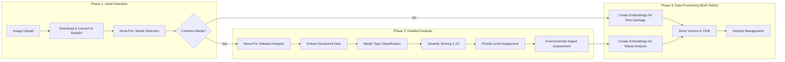

# EcoLafaek API

<!-- Logo Pairing -->
<p align="center">
  
  <span style="font-size: 36px; font-weight: bold; margin: 0 20px;">
</p>

<!-- Technology Stack Badges -->
<p align="center">
  
  
  
  
  
  
  
</p>

## 🌱 Project Overview

This is a powerful backend service for an environmental waste monitoring system in Timor-Leste. Named after the crocodile ("Lafaek") which is considered sacred in Timorese culture, this project aims to protect the natural environment through community-driven waste reporting and AI-powered analysis using Amazon Nova Pro.

**Live API :** [https://ecolafaek.com](https://ecolafaek.com)  
**Public Dashboard:** [https://www.ecolafaek.xyz/](https://www.ecolafaek.xyz/)  
**Mobile App Download:** [https://www.ecolafaek.xyz/download](https://www.ecolafaek.xyz/download)

## 🤖 AI-Powered Environmental Monitoring

EcoLafaek demonstrates the transformative potential of Amazon Nova Pro for environmental monitoring and civic engagement in developing regions.

**Test Credentials for Judges In Mobile App:**

```
Username: usertest
Password: 1234abcd
```

## 🗄️ TiDB Database Implementation

### How We Use TiDB

EcoLafaek leverages TiDB's advanced capabilities to create a powerful, scalable environmental monitoring system. Our implementation takes advantage of TiDB's unique combination of distributed SQL and vector search capabilities.

#### Vector Database Integration

We use TiDB's native vector storage for AI-powered data analysis:

```sql
CREATE TABLE analysis_results (
    result_id INT AUTO_INCREMENT PRIMARY KEY,
    report_id INT NOT NULL,
    waste_type VARCHAR(100),
    severity_score INT,
    priority_level VARCHAR(20),
    image_embedding VECTOR(1024),     -- Content-based embeddings
    location_embedding VECTOR(1024),  -- Geographic embeddings
    environmental_impact TEXT,
    analysis_notes TEXT,
    created_at TIMESTAMP DEFAULT CURRENT_TIMESTAMP,
    FOREIGN KEY (report_id) REFERENCES reports(report_id)
);
```

#### Geospatial and Vector Combined Queries

TiDB enables sophisticated queries combining traditional geospatial calculations with vector similarity:

```sql
-- Hotspot detection using geographic clustering
SELECT
    AVG(latitude) as hotspot_lat,
    AVG(longitude) as hotspot_lon,
    COUNT(*) as report_count,
    AVG(a.severity_score) as avg_severity
FROM reports r
JOIN analysis_results a ON r.report_id = a.report_id
WHERE (
    6371 * acos(cos(radians(-8.5567)) * cos(radians(r.latitude)) *
    cos(radians(r.longitude) - radians(125.5736)) + sin(radians(-8.5567)) *
    sin(radians(r.latitude)))
) <= 0.5  -- Within 500 meters
GROUP BY
    ROUND(latitude, 3),
    ROUND(longitude, 3)
HAVING report_count >= 3;
```

### TiDB Features We Leverage

#### 1. Vector Storage and Search

```python
# Store embeddings in TiDB
cursor.execute("""
    INSERT INTO analysis_results
    (report_id, image_embedding, location_embedding, ...)
    VALUES (%s, %s, %s, ...)
""", (
    report_id,
    json.dumps(image_embedding),  # 1024-dimensional vector
    json.dumps(location_embedding),  # Geographic context vector
    # ... other fields
))
```

#### 2. Distributed Transactions

```python
# Atomic report processing with ACID guarantees
try:
    cursor.execute("START TRANSACTION")

    # Insert report
    cursor.execute("INSERT INTO reports (...) VALUES (...)")
    report_id = cursor.lastrowid

    # Insert analysis results with embeddings
    cursor.execute("INSERT INTO analysis_results (...) VALUES (...)")

    # Update or create hotspot
    cursor.execute("INSERT INTO hotspots (...) ON DUPLICATE KEY UPDATE ...")

    cursor.execute("COMMIT")
except Exception as e:
    cursor.execute("ROLLBACK")
    raise e
```

#### 3. Horizontal Scaling

TiDB automatically handles data distribution as EcoLafaek grows:

- **TiKV Storage Layer**: Distributes waste report data across nodes
- **TiFlash Columnar Storage**: Accelerates analytical queries for dashboard
- **Auto-Sharding**: Handles growing vector embeddings dataset

#### 4. MySQL Compatibility

Seamless integration with existing Python ecosystem:

```python
import mysql.connector

# Standard MySQL connector works perfectly with TiDB
connection = mysql.connector.connect(
    host=DB_HOST,
    port=4000,  # TiDB default port
    database=DB_NAME,
    user=DB_USER,
    password=DB_PASSWORD,
    ssl_disabled=True
)
```

### Performance Optimizations

#### Query Optimization

```sql
-- Optimized hotspot detection with proper indexing
CREATE INDEX idx_reports_location ON reports(latitude, longitude);
CREATE INDEX idx_analysis_severity ON analysis_results(severity_score, created_at);
CREATE INDEX idx_reports_date ON reports(report_date);
```

### TiDB Benefits

1. **Unified Data Platform**: Store both traditional waste report data and AI vector embeddings in one system
2. **Real-time Processing**: Handle concurrent report submissions from mobile app users
3. **Scalable Analytics**: Grow from local Timor-Leste deployment to regional environmental monitoring
4. **Cost-Effective**: Distributed architecture eliminates need for separate vector database
5. **Developer Friendly**: MySQL compatibility speeds development and deployment

## 🧠 Amazon Nova Pro Implementation

### How We Use Amazon Nova Pro

The core intelligence of EcoLafaek is powered by Amazon Nova Pro, which provides sophisticated multimodal analysis for waste images. Our implementation uses a comprehensive analysis approach:

#### Waste Detection with Nova Pro

We use **Amazon Nova Pro** to perform comprehensive analysis of images:

```python
payload = {
    "model": "amazon.nova-pro-v1:0",
    "messages": messages,
    "temperature": 0.1,
}
```

Nova Pro provides comprehensive analysis including:

- Waste type classification (Plastic, Metal, Paper, Organic, etc.)
- Severity assessment (1-10 scale)
- Priority level (low, medium, high, critical)
- Environmental impact evaluation
- Volume estimation
- Safety concern identification
- Detailed analysis notes and recommendations

### Resilient Processing Implementation

Our implementation includes a sophisticated retry mechanism to ensure robustness:

```python
max_attempts = 3  # Maximum number of retry attempts
current_attempt = 0

while current_attempt < max_attempts:
    try:
        current_attempt += 1
        logger.info(f"Attempt {current_attempt} - Analyzing image from: {image_url}")

        # Analysis code here...

    except Exception as e:
        logger.error(f"Error in analysis (Attempt {current_attempt}/{max_attempts}): {e}")
        if current_attempt < max_attempts:
            logger.info(f"Retrying... ({current_attempt}/{max_attempts})")
            time.sleep(2)  # Add a short delay before retrying
            continue
        return None
```

This approach ensures:

- Multiple attempts for API calls in case of temporary failures
- Proper error logging for debugging
- Fallback options when parsing fails
- Graceful degradation of service

## 🔍 Vector Embeddings & Data Storage

### Amazon Titan Embed Image v1 Integration

EcoLafaek uses **Amazon Titan Embed Image v1** model to create embeddings from waste analysis data and location information. These embeddings are stored as vectors for future analysis and potential pattern recognition capabilities.

#### Multimodal Embeddings

We use Titan Embed Image v1 for creating embeddings from:

1. **Image Content**: Visual analysis results from Nova Pro converted to text descriptions
2. **Location Context**: Geographic coordinates enhanced with regional information
3. **Combined Features**: Semantic understanding of waste patterns and environmental context

```python
def invoke_titan_embed_text(text: str) -> Optional[List[float]]:
    """Create embedding for text using Amazon Titan Embed Image (multimodal)"""
    payload = {
        "inputText": text,
        "embeddingConfig": {
            "outputEmbeddingLength": 1024
        }
    }

    response = requests.post(
        f"{BEDROCK_ENDPOINT}/model/amazon.titan-embed-image-v1/invoke",
        headers=headers,
        json=payload,
        timeout=30
    )
    return response.json().get('embedding', [])
```

#### TiDB Vector Storage

All embeddings are stored in TiDB using VECTOR(1024) columns for future analysis:

```sql
CREATE TABLE analysis_results (
    -- ... other columns ...
    image_embedding VECTOR(1024),     -- Content-based embeddings
    location_embedding VECTOR(1024),  -- Location-based embeddings
    -- ... other columns ...
);
```

#### Location-Enhanced Embeddings

We create rich location embeddings that include:

```python
def create_location_embedding(latitude: float, longitude: float) -> List[float]:
    location_text = f"latitude {latitude:.6f} longitude {longitude:.6f}"

    # Add Timor-Leste geographic context
    if -8.3 <= latitude <= -8.1 and 125.5 <= longitude <= 125.7:
        location_text += " Dili capital city urban area high population density"
    elif -8.5 <= latitude <= -8.0 and 125.0 <= longitude <= 127.0:
        location_text += " northern Timor-Leste coastal region moderate population"
    elif latitude < -8.5:
        location_text += " southern Timor-Leste mountainous rural area"

    return invoke_titan_embed_text(location_text)
```

#### Content-Based Embeddings

Image analysis results are converted to rich text descriptions for embedding:

```python
def create_image_content_embedding(analysis_result: dict) -> List[float]:
    content_parts = [
        f"Waste type: {analysis_result.get('waste_type', 'unknown')}",
        f"Severity level {analysis_result.get('severity_score', 1)} out of 10",
        f"Priority: {analysis_result.get('priority_level', 'low')}",
        f"Environmental impact: {analysis_result.get('environmental_impact', '')}",
        f"Safety concerns: {analysis_result.get('safety_concerns', '')}",
        f"Volume: {analysis_result.get('estimated_volume', '0')} cubic meters",
        f"Description: {analysis_result.get('analysis_notes', '')}"
    ]

    content_text = " ".join([part for part in content_parts if part.split(': ')[1]])
    return invoke_titan_embed_text(content_text)
```

### Embedding Generation Process

- **Universal Generation**: Embeddings created for **ALL** reports (both waste and non-waste)
- **Parallel Processing**: Embeddings generated concurrently with Nova Pro analysis
- **Comprehensive Storage**: Every report (garbage or no garbage) has embeddings stored in database
- **Future-Ready**: Complete vector dataset prepared for potential search and analysis features

### Nova Pro Prompting Strategy

Our prompts are carefully engineered for consistent, structured responses:

1. **Context-Rich Instructions**: We provide detailed context about environmental waste classification
2. **Clear Classification Criteria**: We define what should and should not be classified as waste
3. **Structured Output Format**: We specify the exact JSON structure for responses
4. **Evaluation Guidelines**: We include specific factors to consider for severity and priority
5. **Rubric-Based Assessment**: We use numerical scales (1-10) for quantifiable metrics

Example prompt structure:

```python
initial_prompt = """
Carefully examine this image and determine if it shows improper waste disposal, garbage, trash, or discarded materials in the environment.

Only classify as waste/garbage if:
1. The items are clearly disposed of improperly in an outdoor environment (on streets, in water bodies, forests, etc.)
2. The items are trash/waste accumulated in trash cans, landfills, or garbage dumps
3. The items are clearly abandoned, broken, or dumped illegally

Do NOT classify as waste/garbage if:
1. The items are in normal use in their intended environment (e.g., electronics on a desk)
2. The items appear to be organized, clean, and in use
3. The items are products being displayed or used normally
4. The image shows an indoor setting with normal household/office items
5. The items are properly stored or displayed

Return your answer as a JSON object with the following structure:
{
  "contains_waste": true/false,
  "confidence": 0-100,
  "reasoning": "brief explanation",
  "short_description": "concise description (max 8 words)",
  "full_description": "detailed description of what you see in the image (2-3 sentences)"
}
"""
```

## 🚀 Key Features

### 🧠 AI-Powered Analysis

- **Amazon Nova Pro Integration**: Advanced multimodal AI for waste image analysis with bearer token authentication
- **Two-Phase Analysis**: Initial waste detection followed by detailed analysis for confirmed waste
- **Intelligent Classification**: Distinguishes between actual waste and everyday objects to reduce false positives
- **Severity Assessment**: 1-10 scale severity scoring with priority levels (low, medium, high, critical)
- **Environmental Impact Evaluation**: Detailed assessment of environmental risks and safety concerns

### 🔍 Vector Embeddings & Data Storage

- **Amazon Titan Embed Image v1**: Multimodal embeddings for both image content and text descriptions
- **TiDB Vector Storage**: 1024-dimensional embeddings stored in TiDB for future analysis
- **Content Embeddings**: Rich text descriptions from Nova Pro analysis converted to vectors
- **Location Embeddings**: Geographic context embeddings with Timor-Leste regional awareness
- **Future-Ready**: Vector data prepared for potential search and analysis capabilities

## 📱 Application Workflow

### 🔄 Waste Report Processing Flow


### 🧠 AI Analysis Pipeline



### 📊 System Architecture


### 🎯 Example Processing Scenarios

#### Scenario 1: Non-Waste Detection


Based on actual system logs from `this image`:

```
1. User submits image of laptop screen with code
2. System downloads image (243,876 bytes)
3. Converts to base64 (325,168 chars)
4. Nova Pro analysis: "Image determined not to contain waste"
5. Report marked as "Not Garbage"
6. System checks for nearby reports (found 3)
7. Associates with existing hotspot 60001
8. Processing complete
```

#### Scenario 2: Actual Waste Detection


Based on actual system logs from `the image above`:

```
1. User submits image of waste pile
2. System downloads image (164,808 bytes)
3. Converts to base64 (219,744 chars)
4. Nova Pro initial detection: Contains waste (95% confidence)
5. Nova Pro detailed analysis returns:
   - Waste Type: Mixed (predominantly plastic)
   - Severity Score: 8/10
   - Priority Level: High
   - Volume: ~10 cubic meters
   - Environmental Impact: High pollution risk
   - Safety Concerns: Sharp objects, fire hazard
6. Generate embeddings for content and location
7. Store analysis results in database
8. Check for nearby reports (found 3)
9. Update existing hotspot 60001
10. Associate report with hotspot
11. Processing complete
```

## 🏭 Environmental Impact Classification

Amazon Nova Pro helps us classify waste into priority levels:

- **Critical** - Immediate hazard, harmful chemicals/materials
- **High** - Significant waste accumulation, potential contamination
- **Medium** - Moderate waste requiring attention
- **Low** - Minor waste issues with limited impact

Each report includes:

- Severity score (1-10)
- Detailed environmental impact assessment
- Safety concerns
- Estimated volume
- Analysis notes with recommended actions

## 🌍 Real-World Impact

EcoLafaek addresses waste management challenges in Timor-Leste:

1. **Limited Municipal Resources**: AI-powered prioritization helps focus cleanup efforts
2. **Civic Engagement**: Community participation through accessible mobile reporting
3. **Data-Driven Policy**: Aggregated statistics inform government decisions
4. **Environmental Protection**: Early identification of hazardous waste
5. **Public Health**: Identification of disease vector breeding grounds
6. **Education**: Raising awareness through accessible information

## 🔧 Technical Implementation

### Core Architecture

1. **FastAPI Framework** with asynchronous support and automatic API documentation
2. **TiDB Vector Database** with 1024-dimensional vector storage and search
3. **Amazon Bedrock Services**:
   - **Nova Pro v1.0** for multimodal waste image analysis
   - **Titan Embed Image v1** for generating content and location embeddings
4. **AWS S3** for secure, scalable image storage
5. **Bearer Token Authentication** for Bedrock API access
6. **MySQL Connector** for TiDB database connections

### Database Schema Features

- **Vector Columns**: `VECTOR(1024)` for image and location embeddings
- **Geospatial Queries**: Haversine formula for distance calculations
- **Hotspot Management**: Automatic clustering and association tables
- **User Authentication**: Secure password storage and email verification
- **Report Lifecycle**: Complete workflow from submission to analysis

### AI/ML Pipeline

1. **Image Processing**: Base64 encoding with MIME type detection
2. **Nova Pro Analysis**: Two-phase detection and classification
3. **Embedding Generation**: Parallel processing for content and location vectors
4. **Vector Storage**: TiDB integration with automatic indexing
5. **Similarity Search**: Cosine distance calculations for pattern matching

### Environment Variables

```bash
# Database Configuration
DB_HOST=your-tidb-host
DB_NAME=db_ecolafaek
DB_USER=your-username
DB_PASSWORD=your-password
DB_PORT=4000

# AWS Bedrock Configuration
BEDRICK_MODEL_ID=amazon.nova-pro-v1:0
AWS_BEARER_TOKEN_BEDROCK=your-bearer-token
BEDRICK_ENDPOINT=https://bedrock-runtime.us-east-1.amazonaws.com

# AWS S3 Configuration
AWS_ACCESS_KEY_ID=your-access-key
AWS_SECRET_ACCESS_KEY=your-secret-key
AWS_REGION=us-east-1
S3_BUCKET_NAME=ecolafaek

# JWT & Email Configuration
JWT_SECRET=your-jwt-secret
JWT_EXPIRATION_HOURS=24
EMAIL_USER=your-email
EMAIL_PASS=your-app-password
EMAIL_SERVER=smtp.gmail.com
EMAIL_PORT=587
```

### Database Schema

Our comprehensive database schema supports environmental waste monitoring with: [Database schema](https://github.com/ajitonelsonn/EcoLafaek/tree/main/database)

## 🚀 Setup and Deployment

The application is deployed on AWS Lightsail with:

1. **NGINX** as a reverse proxy
2. **Gunicorn** with extended timeout for Nova Pro processing
3. **SSL/TLS** encryption via Let's Encrypt
4. **Systemd** service for automatic restarts
5. **Proper error handling** with retry mechanisms

## 🚀 Live Demo

Our complete EcoLafaek ecosystem is publicly accessible for demonstration purposes:

- **Health Check Endpoint:** [https://ecolafaek.xyz/health](https://ecolafaek.com/health)
- **Public Dashboard:** [https://www.ecolafaek.com/](https://www.ecolafaek.xyz/)
- **Mobile App Download:** [https://www.ecolafaek.com/download](https://www.ecolafaek.xyz/download)

### 🧪 Test Credentials

For hackathon judges and testers, use these credentials:

```
Username: usertest
Password: 1234abcd
```

You can use these credentials in:

- The mobile app to create and submit waste reports
- Direct API calls as shown below

### 🔍 Example API Calls

**Authentication:**

```bash
curl -X POST https://ecolafaek.xyz/api/auth/login \
  -H "Content-Type: application/json" \
  -d '{"username":"usertest","password":"1234abcd"}'
```

**Test Nova Pro Analysis:**

```bash
curl -X GET "https://ecolafaek.xyz/api/test/nova?image_url=https://example.com/waste-image.jpg" \
  -H "Authorization: Bearer your_token_here"
```

**List User Reports:**

```bash
curl -X GET "https://ecolafaek.xyz/api/reports?page=1&per_page=10" \
  -H "Authorization: Bearer your_token_here"
```

**Get Report Details:**

```bash
curl -X GET "https://ecolafaek.xyz/api/reports/12345" \
  -H "Authorization: Bearer your_token_here"
```

**Dashboard Statistics:**

```bash
curl -X GET "https://ecolafaek.xyz/api/dashboard/stats" \
  -H "Authorization: Bearer your_token_here"
```

**Get Hotspots:**

```bash
curl -X GET "https://ecolafaek.xyz/api/hotspots?lat=-8.55&lon=125.58&radius=5" \
  -H "Authorization: Bearer your_token_here"
```

Replace `your_token_here` with the token received from the login response.

---

## 📞 Support

For technical support or questions:

- Create an issue in this repository
- Contact: [ecolafaek@gmail.com](mailto:support@ecolafaek.com)
- Documentation: [https://docs.ecolafaek.com](https://docs.ecolafaek.com)

---

<div align="center">
  <p>Built with ❤️ for Timor-Leste</p>
</div>
